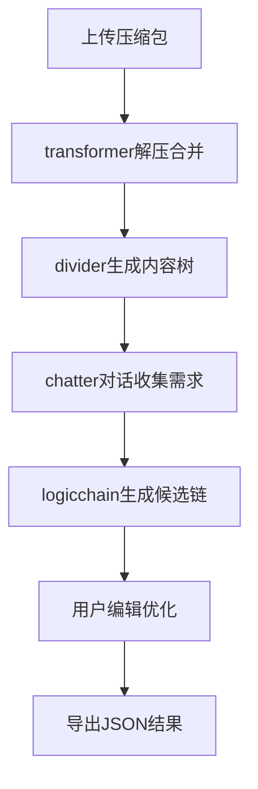

## 1. 产品概述

Combine-v2是一个基于本地Python实现的智能论文PPT生成工具，通过集成现有transformer模块，实现论文上传合并、AI对话收集需求、内容树构建和逻辑链生成功能。

该工具专为研究人员设计，解决了论文内容提取困难、PPT结构规划复杂、需求表达不完整等痛点。通过本地化处理，保护用户数据隐私，同时提供高效的论文到PPT转换体验。

## 2. 核心功能

### 2.1 用户角色

| 角色 | 注册方式 | 核心权限 |
|------|----------|----------|
| 本地用户 | 无需注册 | 本地文件上传、AI对话、逻辑链生成、结果导出 |

### 2.2 功能模块

我们的本地论文PPT生成工具包含以下核心页面：

1. **文件上传页面**：支持压缩包上传，自动解压合并，基于transformer模块处理
2. **AI对话页面**：集成现有chatter模块，多轮对话收集PPT需求，支持上下文记忆
3. **内容树展示页面**：基于divider模块生成层次化内容树，展示论文结构和知识对象
4. **逻辑链编辑页面**：展示候选逻辑链，支持交互式编辑和关系可视化
5. **结果导出页面**：导出JSON格式的逻辑链和配置信息

### 2.3 页面详情

| 页面名称 | 模块名称 | 功能描述 |
|----------|----------|----------|
| 文件上传页面 | 压缩包上传 | 支持.zip/.tar/.gz格式，拖拽上传，显示文件列表和处理进度 |
| 文件上传页面 | 自动解压合并 | 调用transformer模块解压并合并文件，识别主文档和依赖文件 |
| 文件上传页面 | 内容预处理 | 提取LaTeX结构，识别章节层次，标记公式图表定理等对象 |
| AI对话页面 | 智能对话 | 基于chatter模块启动AI对话，根据论文内容提供个性化需求收集 |
| AI对话页面 | 上下文记忆 | 维护对话历史，结合论文摘要提供针对性建议，引用具体章节 |
| AI对话页面 | 需求提取 | 自动提取听众类型、演讲时长、重点内容等PPT关键需求 |
| 内容树展示页面 | 层次结构 | 基于divider模块输出，树形展示论文章节结构和内容层次 |
| 内容树展示页面 | 知识对象 | 高亮显示公式、图表、定理等关键知识对象，支持点击查看详情 |
| 内容树展示页面 | 内容预览 | 提供章节内容预览，支持折叠展开，快速浏览论文结构 |
| 逻辑链编辑页面 | 候选展示 | 以卡片形式展示多条逻辑链，横向排列，显示节点连接关系 |
| 逻辑链编辑页面 | 交互编辑 | 支持拖拽调整节点顺序，添加删除节点，实时更新逻辑关系 |
| 逻辑链编辑页面 | 关系可视化 | 动态展示节点间逻辑关系，hover显示连接理由，支持手动编辑连接 |
| 结果导出页面 | JSON导出 | 导出包含完整逻辑链、节点信息、时间分配的JSON配置文件 |
| 结果导出页面 | 配置预览 | 展示最终逻辑链的详细信息，包括演讲时间分配和重点标注 |

## 3. 核心流程

### 用户使用流程

1. 用户启动Streamlit应用，进入文件上传页面
2. 上传论文压缩包，系统自动解压并合并文件
3. 进入AI对话页面，基于论文内容进行需求收集对话
4. 查看内容树展示，确认论文结构分析结果
5. 在逻辑链编辑页面查看和优化候选逻辑链
6. 导出最终结果，保存到本地

### 数据处理流程

## 4. 用户界面设计

### 4.1 设计样式

- **主色调**: 深蓝色背景 (#1e3a8a) 配白色文字
- **辅助色**: 青色 (#06b6d4) 用于强调和交互元素
- **布局风格**: 简洁的卡片式布局，适合Streamlit默认主题
- **字体**: Streamlit默认字体，确保跨平台一致性
- **图标**: 使用emoji图标增强可读性，如📄上传、💬对话、🔗逻辑链

### 4.2 页面设计概述

| 页面名称 | 模块名称 | UI元素 |
|----------|----------|--------|
| 文件上传页面 | 上传区域 | 中央大按钮，支持拖拽，显示上传进度条 |
| 文件上传页面 | 文件列表 | 表格展示上传文件，显示大小和处理状态 |
| AI对话页面 | 对话界面 | 类似聊天应用的对话气泡，用户右对齐，AI左对齐 |
| AI对话页面 | 输入区域 | 底部文本输入框，支持多行输入和发送按钮 |
| 内容树展示页面 | 树形结构 | 可折叠的树形控件，节点颜色区分类型 |
| 内容树展示页面 | 详情面板 | 右侧面板显示选中节点的详细内容 |
| 逻辑链编辑页面 | 链式卡片 | 横向排列的卡片，显示节点顺序和连接 |
| 逻辑链编辑页面 | 编辑工具栏 | 顶部工具栏提供添加、删除、移动操作 |
| 结果导出页面 | 配置预览 | 代码块形式展示JSON配置，支持复制下载 |

### 4.3 响应式设计

- 采用桌面优先设计，主要优化大屏幕体验
- Streamlit自动适配不同屏幕尺寸
- 支持基本的移动端访问
- 重点优化桌面端的专业用户使用体验

### 4.4 交互设计

- **即时反馈**: 所有操作都有明确的视觉反馈
- **进度提示**: 文件上传和处理显示实时进度
- **错误处理**: 友好的错误提示，提供解决建议
- **状态保持**: 自动保存会话状态，支持页面切换
- **键盘支持**: 支持基本的键盘快捷键操作