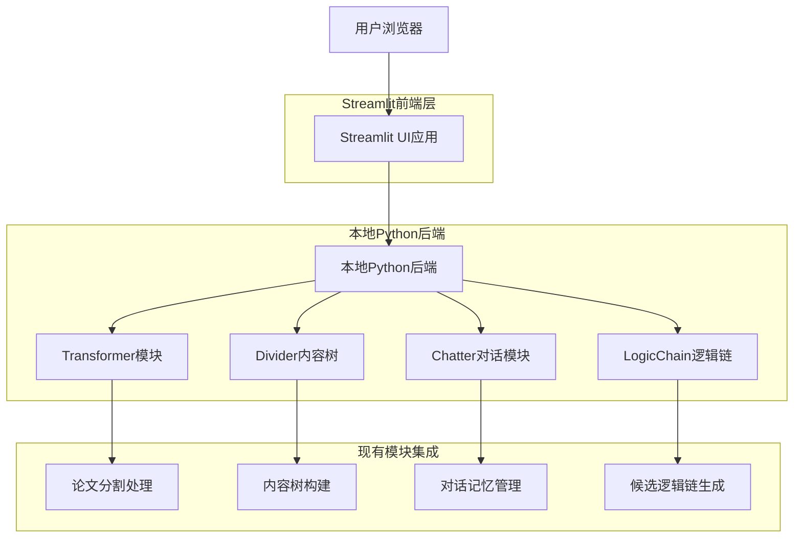

## 1. 架构设计



## 2. 技术描述

- **前端**: Streamlit@1.28 + Python@3.12
- **后端**: 本地Python，基于现有transformer模块
- **文件处理**: 标准Python库（zipfile、tarfile、os、pathlib）
- **对话管理**: 基于现有chatter模块实现
- **内容分析**: 基于现有divider模块实现
- **逻辑链生成**: 基于现有logicchain模块实现
- **数据存储**: 本地JSON文件存储
- **初始化工具**: pip-requirements

## 3. 核心模块定义

### 3.1 Streamlit页面路由

| 页面 | 路由参数 | 功能描述 |
|------|----------|----------|
| 主页 | page=home | 文件上传和项目概览 |
| 对话收集 | page=chat | AI对话收集PPT需求 |
| 内容树 | page=tree | 展示divider生成的内容树 |
| 逻辑链 | page=chains | 展示和编辑候选逻辑链 |
| 结果导出 | page=export | 导出最终结果 |

### 3.2 核心API接口

文件上传和处理
```python
def upload_and_process_file(uploaded_file):
    """处理上传的压缩文件"""
    # 保存上传文件
    # 解压到临时目录
    # 调用transformer模块处理
    # 返回处理结果
```

内容树生成
```python
def generate_content_tree(processed_files):
    """基于divider模块生成内容树"""
    # 调用现有divider模块
    # 构建层次化内容结构
    # 提取知识对象
    # 返回树形结构
```

逻辑链生成
```python
def generate_logic_chains(content_tree, chat_history):
    """基于logicchain模块生成候选逻辑链"""
    # 分析内容树结构
    # 结合对话历史
    # 生成多条逻辑链
    # 计算评分和推荐
```

## 4. 数据模型

### 4.1 会话数据模型

```python
class SessionData:
    session_id: str
    upload_files: List[Dict]
    chat_history: List[Dict]
    content_tree: Dict
    logic_chains: List[Dict]
    created_at: datetime
    updated_at: datetime
```

### 4.2 文件处理模型

```python
class ProcessedFile:
    filename: str
    file_path: str
    file_type: str
    content: str
    metadata: Dict
    processing_status: str
```

### 4.3 内容树节点模型

```python
class ContentNode:
    id: str
    title: str
    content: str
    node_type: str  # section, formula, figure, theorem
    level: int
    parent_id: str
    children: List[str]
    metadata: Dict
```

## 5. 核心算法实现

### 5.1 文件上传合并算法

1. **文件验证**: 检查文件格式和大小
2. **解压处理**: 使用zipfile/tarfile解压
3. **主文件识别**: 查找主.tex文件或核心文档
4. **依赖解析**: 识别并合并相关文件（图片、样式等）
5. **内容整合**: 生成统一的处理文档

### 5.2 内容树构建算法

1. **结构识别**: 使用正则表达式识别LaTeX结构
2. **层次解析**: 递归构建章节层次
3. **对象提取**: 识别公式、图表、定理等知识对象
4. **关系建立**: 构建节点间的逻辑关系
5. **摘要生成**: 为每个节点生成简洁摘要

### 5.3 对话记忆算法

1. **上下文跟踪**: 维护对话状态和历史
2. **意图识别**: 分析用户输入的意图
3. **信息提取**: 提取PPT需求的关键信息
4. **个性化推荐**: 基于论文内容提供建议
5. **状态更新**: 实时更新对话状态

### 5.4 逻辑链生成算法

1. **模板匹配**: 根据内容类型选择合适的模板
2. **节点评分**: 评估内容节点的重要性
3. **链式构建**: 构建多条候选逻辑链
4. **时间分配**: 优化每个节点的时间分配
5. **证据链接**: 建立节点间的证据支持关系

## 6. 本地存储设计

### 6.1 会话存储

```python
# 会话数据存储在本地JSON文件
sessions/
├── {session_id}_data.json      # 会话完整数据
├── {session_id}_files/         # 上传文件目录
└── {session_id}_temp/           # 临时处理目录
```

### 6.2 缓存机制

- **处理结果缓存**: 避免重复处理相同文件
- **内容树缓存**: 缓存divider模块输出
- **逻辑链缓存**: 缓存生成的候选逻辑链
- **会话状态缓存**: 维护用户操作状态

## 7. 性能优化

### 7.1 异步处理

- **文件上传**: 使用Streamlit的异步上传组件
- **内容处理**: 后台线程处理大文件
- **结果展示**: 渐进式加载和展示

### 7.2 内存管理

- **流式处理**: 大文件分块处理
- **及时清理**: 处理完成后清理临时文件
- **资源限制**: 设置单文件大小和处理时间限制

### 7.3 错误处理

- **文件格式错误**: 友好的错误提示和恢复建议
- **处理超时**: 自动重试机制和进度保存
- **内存不足**: 优雅降级和分批处理