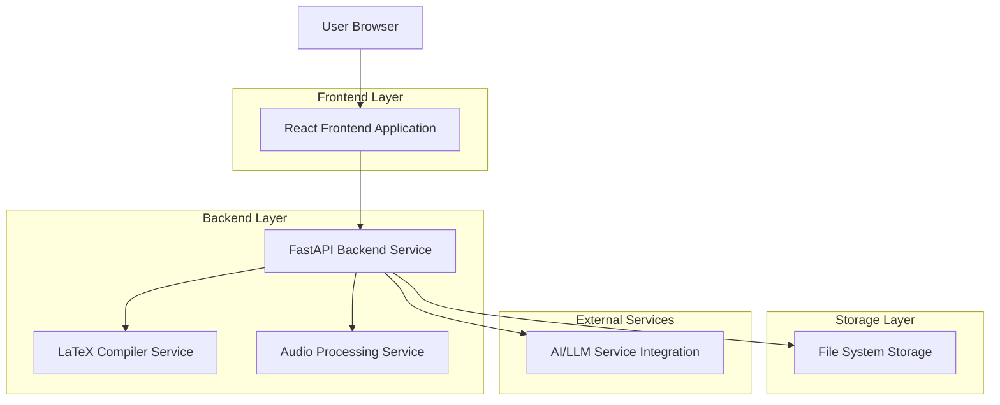
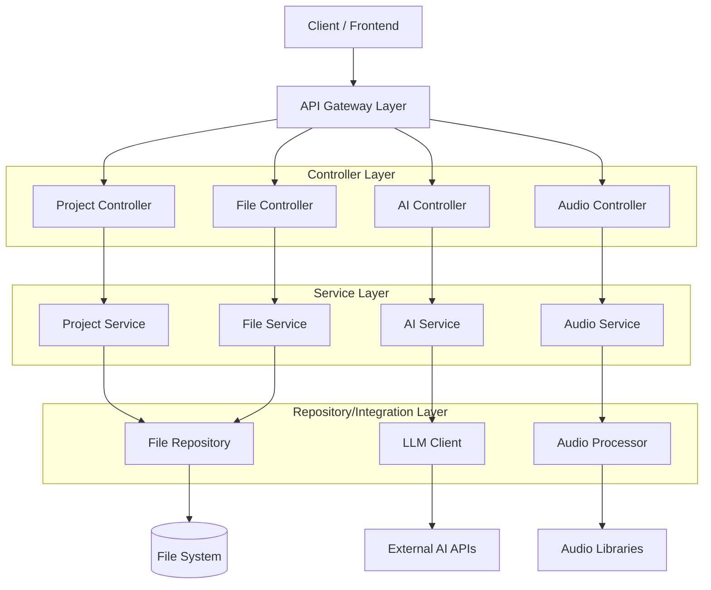
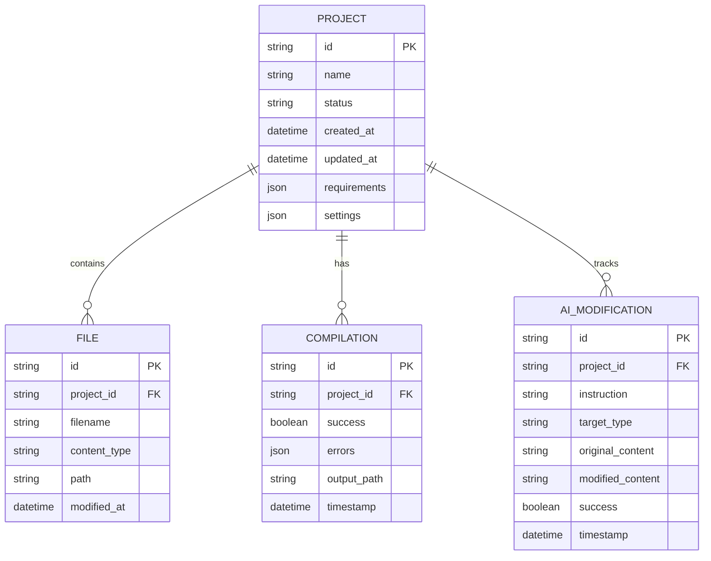

# DeepSlide Migration: Streamlit to React + FastAPI Architecture

## 1. Architecture Design



## 2. Technology Description

- **Frontend**: React@18 + TypeScript + TailwindCSS@3 + Vite
- **Initialization Tool**: vite-init
- **Backend**: FastAPI@0.104 + Python@3.11
- **State Management**: Zustand for frontend state management
- **UI Components**: HeadlessUI + Radix UI components
- **File Processing**: aiofiles for async file operations
- **LaTeX Compilation**: pdflatex/xelatex subprocess management
- **AI Integration**: OpenAI API, CAMEL framework integration
- **Audio Processing**: pydub, speech_recognition, TTS services

## 3. Route Definitions

| Route | Purpose |
|-------|---------|
| / | Main editor interface with slide preview and editing panels |
| /api/health | Health check endpoint for service monitoring |
| /api/project/create | Initialize new presentation project |
| /api/project/{id}/state | Get current project state and files |
| /api/project/{id}/compile | Compile LaTeX to PDF |
| /api/project/{id}/preview | Get slide preview images |
| /api/project/{id}/files/{filename} | Read/write specific project files |
| /api/project/{id}/ai/modify | AI-powered slide modification |
| /api/project/{id}/ai/beautify | AI slide beautification |
| /api/project/{id}/ai/enrich | AI content enrichment |
| /api/project/{id}/speech/generate | Generate speech audio from text |
| /api/project/{id}/speech/transcribe | Transcribe audio to text |
| /api/project/{id}/export/html | Export presentation as HTML |
| /api/project/{id}/export/pdf | Download PDF presentation |

## 4. API Definitions

### 4.1 Project Management APIs

**Create Project**
```
POST /api/project/create
```

Request:
| Param Name | Param Type | isRequired | Description |
|------------|-------------|-------------|-------------|
| requirements | object | true | Presentation requirements and specifications |
| template | string | false | LaTeX template to use |

Response:
| Param Name | Param Type | Description |
|------------|-------------|-------------|
| project_id | string | Unique project identifier |
| status | string | Project creation status |

### 4.2 File Management APIs

**Update File Content**
```
PUT /api/project/{id}/files/{filename}
```

Request:
| Param Name | Param Type | isRequired | Description |
|------------|-------------|-------------|-------------|
| content | string | true | File content to save |

Response:
| Param Name | Param Type | Description |
|------------|-------------|-------------|
| success | boolean | Update operation status |
| message | string | Status message |

### 4.3 AI Processing APIs

**AI Slide Modification**
```
POST /api/project/{id}/ai/modify
```

Request:
| Param Name | Param Type | isRequired | Description |
|------------|-------------|-------------|-------------|
| instruction | string | true | Natural language modification instruction |
| target_type | string | true | Target: "content", "speech", "title" |
| page_index | number | false | Specific page index (optional) |

Response:
| Param Name | Param Type | Description |
|------------|-------------|-------------|
| success | boolean | Modification status |
| modified_content | string | Updated content |
| compilation_result | object | LaTeX compilation result |

### 4.4 Audio Processing APIs

**Generate Speech Audio**
```
POST /api/project/{id}/speech/generate
```

Request:
| Param Name | Param Type | isRequired | Description |
|------------|-------------|-------------|-------------|
| text | string | true | Speech text to synthesize |
| voice_id | string | false | Voice model identifier |
| page_index | number | true | Page index for audio file naming |

Response:
| Param Name | Param Type | Description |
|------------|-------------|-------------|
| audio_url | string | URL to generated audio file |
| duration | number | Audio duration in seconds |

## 5. Server Architecture Diagram



## 6. Data Model

### 6.1 Project Data Structure



### 6.2 Core File Types

The system manages these essential file types per project:
- `content.tex` - Main slide content LaTeX
- `title.tex` - Title page LaTeX
- `base.tex` - Base LaTeX template
- `speech.txt` - Speech scripts per slide
- `main.pdf` - Compiled presentation PDF
- `preview/*.png` - Generated preview images
- `audio/*.wav` - Generated speech audio files

## 7. Frontend Component Architecture

### 7.1 Component Hierarchy

```
App
├── EditorLayout
│   ├── PreviewPanel
│   │   ├── SlidePreview
│   │   ├── NavigationControls
│   │   └── SpeechDisplay
│   ├── EditorPanel
│   │   ├── BasicEditor
│   │   │   ├── ContentTab
│   │   │   ├── SpeechTab
│   │   │   ├── TitleTab
│   │   │   └── BaseTab
│   │   └── AIEditor
│   │       ├── VoiceTab
│   │       ├── BeautifyTab
│   │       └── EnrichTab
│   └── InputBar
│       ├── AudioRecorder
│       └── TextInput
└── StatusBar
```

### 7.2 State Management Structure

```typescript
interface AppState {
  project: {
    id: string;
    name: string;
    status: string;
    files: Record<string, string>;
  };
  preview: {
    currentPage: number;
    totalPages: number;
    pdfPages: string[];
    speechSegments: string[];
    autoPlay: boolean;
  };
  editor: {
    activePanel: 'basic' | 'ai';
    basicTab: 'content' | 'speech' | 'title' | 'base';
    aiTab: 'voice' | 'beautify' | 'enrich';
    content: string;
    speech: string;
    title: string;
    base: string;
  };
  ai: {
    isProcessing: boolean;
    lastInstruction: string;
    modifications: AIModification[];
  };
}
```

## 8. Migration Strategy

### Phase 1: Backend Foundation (Week 1-2)
1. Set up FastAPI project structure with proper error handling
2. Implement core file management services
3. Create LaTeX compilation service wrapper
4. Develop project state management system
5. Build basic API endpoints for CRUD operations

### Phase 2: AI Integration (Week 2-3)
1. Migrate AI agent logic from `ppt_agent.py` to service layer
2. Implement AI modification endpoints with proper validation
3. Create async processing for AI operations
4. Add error handling and retry mechanisms
5. Implement AI content caching strategy

### Phase 3: Audio Processing (Week 3)
1. Migrate audio processing from Streamlit to FastAPI
2. Implement async audio generation endpoints
3. Create audio file management system
4. Add speech transcription capabilities
5. Implement audio streaming for large files

### Phase 4: Frontend Development (Week 3-4)
1. Set up React project with TypeScript and TailwindCSS
2. Implement core layout components (EditorLayout, PreviewPanel)
3. Build file editor components with syntax highlighting
4. Create AI tool interfaces (voice, beautify, enrich)
5. Implement state management with Zustand

### Phase 5: Integration & Testing (Week 4-5)
1. Connect frontend to backend API endpoints
2. Implement real-time preview updates
3. Add comprehensive error handling
4. Create automated testing suite
5. Performance optimization and caching

### Phase 6: Deployment & Migration (Week 5-6)
1. Set up production deployment infrastructure
2. Implement data migration from Streamlit sessions
3. Create user documentation and guides
4. Conduct user acceptance testing
5. Gradual rollout with rollback plan

## 9. Key Architectural Improvements

### 9.1 Separation of Concerns
- **Frontend**: Pure UI/UX handling with React
- **Backend**: Business logic and AI processing with FastAPI
- **Storage**: Dedicated file system management
- **Processing**: Isolated compilation and AI services

### 9.2 Performance Enhancements
- **Async Processing**: Non-blocking AI operations
- **Caching Strategy**: Intelligent content and preview caching
- **Streaming**: Large file handling with streaming
- **Optimized Builds**: Separate frontend/backend deployment

### 9.3 Scalability Features
- **Horizontal Scaling**: Stateless backend design
- **Load Balancing**: API endpoint distribution
- **Resource Management**: Efficient file and memory handling
- **Monitoring**: Comprehensive logging and metrics

### 9.4 Developer Experience
- **Type Safety**: Full TypeScript implementation
- **API Documentation**: Auto-generated OpenAPI specs
- **Development Tools**: Hot reload, debugging tools
- **Testing**: Comprehensive test coverage

This architecture provides a robust, scalable foundation for the DeepSlide application while maintaining all existing functionality and enabling future enhancements.