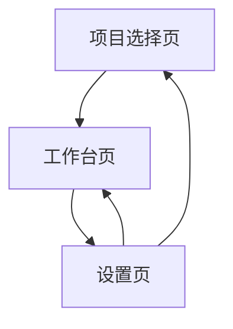

## 1. Product Overview
deepslide-stage3 是一个面向本地磁盘项目的“编辑 + 预览 + AI 调试”工作台。
项目源目录来自环境变量 `DEEPSLIDE_PROJECTS_DIR`，你可以直接选择/打开磁盘项目目录进行编辑预览与 AI 调试。

## 2. Core Features

### 2.1 Feature Module
本阶段需求由以下核心页面组成：
1. **项目选择页**：从 `DEEPSLIDE_PROJECTS_DIR` 浏览项目、选择/打开磁盘目录、进入工作台。
2. **工作台页**：文件树浏览、代码编辑、实时预览/刷新、AI 调试对话与建议、应用修复到文件。
3. **设置页**：配置项目源目录、配置 AI 调试所需的 API Key/模型、预览与调试偏好设置。

### 2.3 Page Details
| Page Name | Module Name | Feature description |
|-----------|-------------|---------------------|
| 项目选择页 | 项目源目录读取 | 从 `DEEPSLIDE_PROJECTS_DIR` 扫描并展示项目列表（名称、最后修改时间、路径）。 |
| 项目选择页 | 打开磁盘目录 | 选择一个本地目录作为项目并校验（存在、可读、包含必要文件/结构）。 |
| 项目选择页 | 最近项目 | 记录并展示最近打开的项目，支持一键再次进入。 |
| 工作台页 | 工程导航（文件树） | 展示项目目录结构；支持搜索、展开/折叠、打开文件。 |
| 工作台页 | 编辑器 | 打开并编辑文本文件；支持保存、撤销/重做、基础语法高亮（按文件类型）。 |
| 工作台页 | 预览 | 启动/刷新项目预览；展示预览状态（运行中/失败）、错误摘要与日志入口。 |
| 工作台页 | AI 调试 | 选择错误/日志/选中文本作为上下文发起调试对话；生成“原因分析 + 可执行修改建议”。 |
| 工作台页 | 应用修复 | 将 AI 给出的补丁/修改点以可预览方式应用到文件（逐文件确认、可回滚）。 |
| 工作台页 | 运行与日志 | 展示构建/运行输出日志；支持复制、清空、按级别过滤（info/warn/error）。 |
| 设置页 | 项目源配置 | 查看/修改 `DEEPSLIDE_PROJECTS_DIR`（或以应用内配置覆盖）；保存后重新扫描。 |
| 设置页 | AI 配置 | 配置 API Key、模型、Base URL（兼容 OpenAI 风格）；提供连通性测试。 |
| 设置页 | 预览/调试偏好 | 设置预览端口/自动刷新、AI 发送上下文大小上限、隐私提示（发送前确认）。 |

## 3. Core Process
- 项目进入流程：你进入项目选择页 → 从项目列表中选择项目或打开磁盘目录 → 校验通过后进入工作台。
- 编辑与预览流程：你在工作台打开文件 → 修改并保存 → 触发自动/手动刷新预览 → 若预览失败可查看日志。
- AI 调试流程：你在日志中选定错误（或选中文本/文件）→ 发起 AI 调试 → AI 返回分析与补丁 → 你逐项确认后应用修复 → 重新预览验证。
- 设置流程：你进入设置页 → 配置项目源目录与 AI Key/模型 → 返回项目选择页或工作台继续使用。

