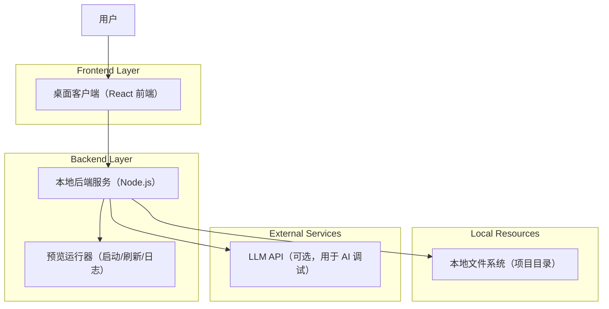
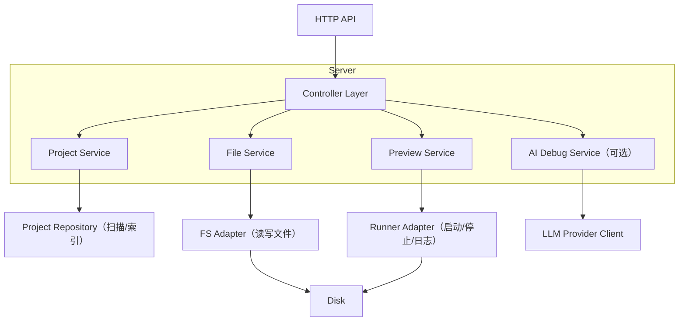
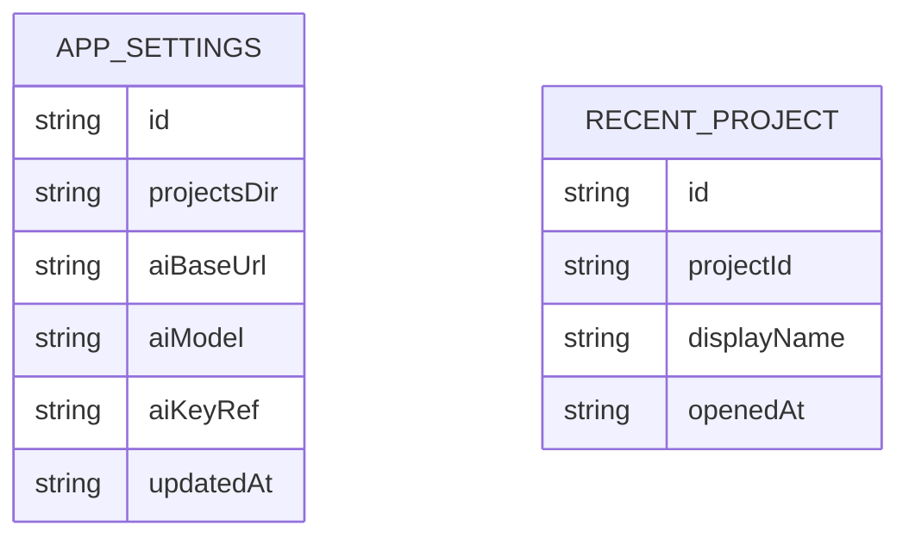

## 1.Architecture design


## 2.Technology Description
- Frontend: React@18 + TypeScript + vite + tailwindcss（或现有样式体系） + Monaco Editor（代码编辑）
- Backend: Node.js@20 + Express（或 Fastify）
- AI（可选）: OpenAI-兼容 API（Key 仅保存在后端/本地安全存储，不进入前端构建产物）

## 3.Route definitions
| Route | Purpose |
|-------|---------|
| / | 项目选择页：浏览 `DEEPSLIDE_PROJECTS_DIR`、打开项目目录 |
| /workspace/:projectId | 工作台页：编辑、预览、日志、AI 调试 |
| /settings | 设置页：项目源目录与 AI 配置 |

## 4.API definitions (If it includes backend services)
### 4.1 Core Types (shared)
```ts
type ProjectRef = {
  id: string;          // 后端生成的稳定标识（可基于路径哈希）
  name: string;
  rootPath: string;    // 仅后端可信；前端展示可做脱敏
  updatedAt: string;   // ISO
};

type FileNode = {
  path: string;        // 相对项目根目录
  kind: "file" | "dir";
};

type FileContent = {
  path: string;        // 相对路径
  content: string;
  etag?: string;       // 可选：用于并发保存检测
};

type PreviewStatus = {
  state: "stopped" | "starting" | "running" | "error";
  url?: string;
  lastError?: string;
};

type AiDebugRequest = {
  projectId: string;
  context: {
    selectedText?: string;
    files?: Array<{ path: string; content: string }>;
    logs?: string;
  };
};

type AiDebugResponse = {
  summary: string;
  rootCause: string;
  patches: Array<{
    path: string;
    description: string;
    unifiedDiff?: string;   // 建议用 diff 便于预览与回滚
    newContent?: string;    // 或直接给目标内容
  }>;
};
```

### 4.2 Core API
项目发现与打开
- `GET /api/projects`：从 `DEEPSLIDE_PROJECTS_DIR` 扫描项目列表
- `POST /api/projects/open`：打开磁盘目录并校验，返回 `ProjectRef`

文件访问
- `GET /api/projects/:projectId/tree`：返回 `FileNode[]`
- `GET /api/projects/:projectId/file?path=...`：读取文件内容
- `PUT /api/projects/:projectId/file`：保存文件（`FileContent`）

预览与日志
- `POST /api/projects/:projectId/preview/start`：启动预览（内部拉起项目命令/渲染器）
- `POST /api/projects/:projectId/preview/restart`：重启/刷新
- `GET /api/projects/:projectId/preview/status`：查询 `PreviewStatus`
- `GET /api/projects/:projectId/logs?tail=...`：拉取日志（或使用 SSE/WebSocket 推送）

AI 调试（可选）
- `POST /api/ai/debug`：提交 `AiDebugRequest`，返回 `AiDebugResponse`

## 5.Server architecture diagram (If it includes backend services)


## 6.Data model(if applicable)
### 6.1 Data model definition
本阶段不引入数据库；仅需要本地配置（如 `settings.json`）与最近项目列表。

