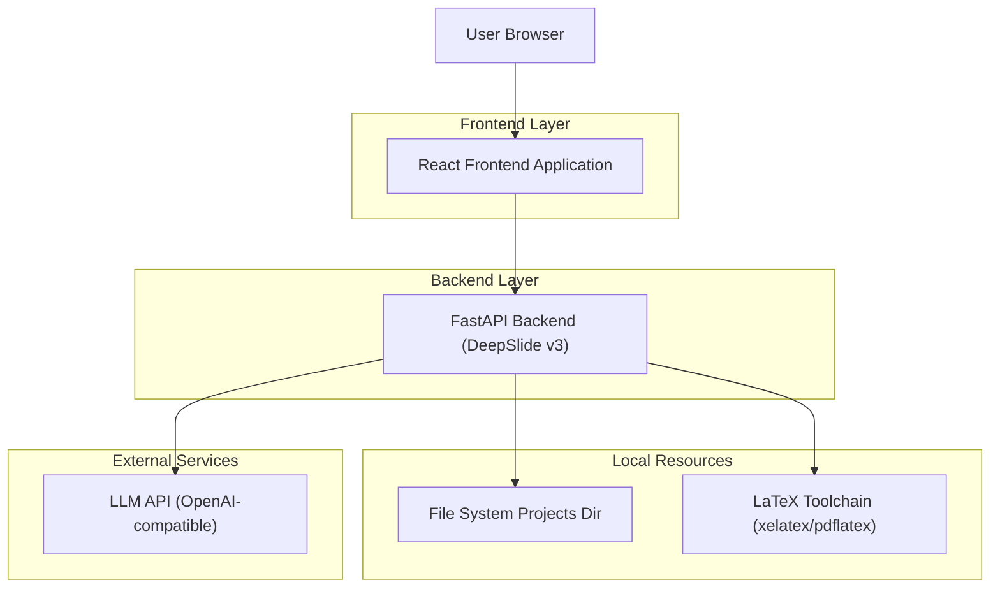
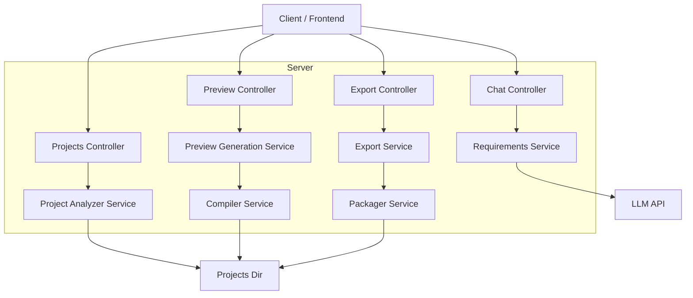

## 1.Architecture design


## 2.Technology Description
- Frontend: React@18 + TypeScript + react-router-dom + tailwindcss@3 + zustand（或等价轻量状态）
- Backend: FastAPI + pydantic
- Storage: 本地文件系统 projects 目录（项目、生成物、导出包）
- Compile & Preview: LaTeX toolchain + PDF→image（用于缩略图/逐页预览）
- LLM: OpenAI-compatible endpoint（Key 仅后端读取 .env）
- Database: None（以项目目录与轻量索引状态为主）

## 3.Route definitions
| Route | Purpose |
|---|---|
| / | 四阶段主流程入口（上传/需求对话/逻辑链/预览导出） |
| /project/:projectId | 阶段四工作台：预览与导出为默认视图，可切换到编辑模式 |

## 4.API definitions (If it includes backend services)

### 4.1 Core Types (TypeScript)
```ts
export type Step = 1 | 2 | 3 | 4;

export type Project = {
  project_id: string;
  name: string;
  created_at: string;
  path: string;
  step: Step;                 // 当前阶段（用于四阶段导航与回退）
  requirements?: Requirements;
  nodes?: LogicNode[];
  edges?: LogicEdge[];
  preview?: PreviewState;
};

export type PreviewState = {
  status: 'idle' | 'generating' | 'ready' | 'failed';
  updated_at?: string;
  pdf_path?: string;
  slide_images?: { page: number; url: string }[];
  error?: { code: string; message: string };
};

export type ExportFormat = 'pdf' | 'images_zip' | 'project_zip';

export type ExportJob = {
  job_id: string;
  format: ExportFormat;
  status: 'queued' | 'running' | 'ready' | 'failed';
  download_url?: string;
  error?: { code: string; message: string };
};
```

### 4.2 Upload & Analyze
- `POST /api/v1/projects/upload`（multipart/form-data）→ Project

### 4.3 Requirements Chat + 无反馈排查所需接口
- `POST /api/v1/projects/{projectId}/chat` → { response, history, is_confirmed, requirements }
- `GET /api/v1/projects/{projectId}/chat/history`
- `GET /api/v1/projects/{projectId}/status`
  - 用于阶段二“无反馈/无反应排查”：返回 server_time、last_action、last_action_at、request_id（如有）、当前 step、preview.status（如已进入生成）

### 4.4 Logic Chain
- `POST /api/v1/projects/{projectId}/nodes`
  - Request: { nodes: LogicNode[], edges?: LogicEdge[] }

### 4.5 Preview（新增阶段四默认视图的数据来源）
- `POST /api/v1/projects/{projectId}/preview/generate`
  - 由阶段三“生成预览”触发；后端执行生成 + 编译 + 产出缩略图
- `GET /api/v1/projects/{projectId}/preview`
  - 返回 PreviewState（供前端轮询/重连）

### 4.6 Export（新增导出选项）
- `POST /api/v1/projects/{projectId}/exports`
  - Request: { format: ExportFormat }
  - Response: ExportJob（异步任务，避免大文件阻塞）
- `GET /api/v1/projects/{projectId}/exports/{jobId}` → ExportJob
- `GET /api/v1/projects/{projectId}/exports/{jobId}/download` → file stream

## 5.Server architecture diagram (If it includes backend services)


## 6.Data model(if applicable)
无数据库；数据以 project 目录与轻量索引文件（如 project.json）持久化，包含 step、requirements、nodes/edges、preview 与