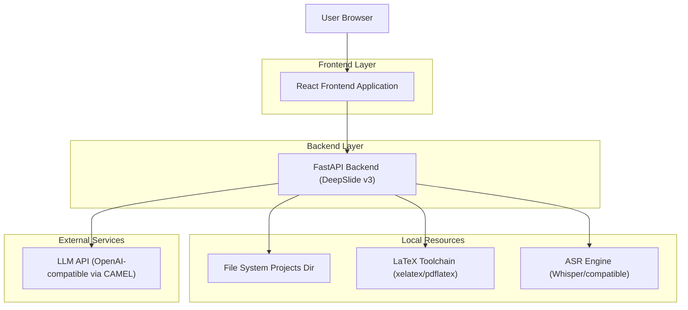
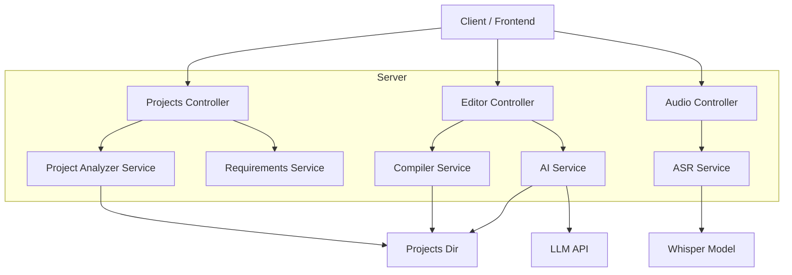

## 1.Architecture design



## 2.Technology Description
- Frontend: React@18 + TypeScript + tailwindcss@3 + vite + zustand + react-router-dom + lucide-react + @dnd-kit/*
- Backend: FastAPI + pydantic
- File/Project Analysis: zipfile/tarfile + LaTeX merge/divide（现有 core services）
- Compile & Preview: LaTeX toolchain + PDF->image（沿用现有 compiler_service）
- LLM: CAMEL ChatAgent + OpenAI-compatible endpoint（API Key 仅在后端读取 .env）
- ASR（第一阶段）: 后端提供 /audio/transcribe，优先本地 whisper/faster-whisper；可选降级为外部 Whisper API（同样仅后端持有 Key）
- Database: None（当前以文件系统 + 进程内 projects_db/collector 状态为主；如需持久化再引入 DB）

## 3.Route definitions
| Route | Purpose |
|-------|---------|
| / | 主流程入口（按 appState 渲染：上传/需求对话/逻辑链） |
| /project/:projectId | 工作台（编辑/预览/AI 指令） |

## 4.API definitions (If it includes backend services)

### 4.1 Core Types (TypeScript)
```ts
export type Project = {
  project_id: string;
  name: string;
  created_at: string;
  path: string;
  nodes?: LogicNode[];
  edges?: LogicEdge[];
  requirements?: Requirements;
  is_confirmed: boolean;
};

export type ChatMessage = { role: 'user' | 'assistant'; content: string };

export type Requirements = {
  audience?: string;
  duration?: string;          // e.g. "10min"
  focus_sections?: string[];
  style_preference?: string;
};

export type LogicNode = {
  node_id: string;
  title: string;
  summary?: string;
  node_type?: 'section' | 'subsection' | 'content';
  duration?: string;          // e.g. "5min"
};

export type LogicEdge = {
  from: string;
  to: string;
  reason?: string;
  type?: 'sequential' | 'reference';
};
```

### 4.2 Project Upload
`POST /api/v1/projects/upload`

Request (multipart/form-data):
| Param Name| Param Type | isRequired | Description |
|-----------|------------|------------|-------------|
| name | string | true | Project name (derived from filename) |
| file | File | true | LaTeX project archive (.zip/.tar/.tar.gz) |

Response: Project

### 4.3 Requirements Chat
`POST /api/v1/projects/{projectId}/chat`

Request:
| Param Name| Param Type | isRequired | Description |
|-----------|------------|------------|-------------|
| message | string | true | User requirement input |

Response:
| Param Name| Param Type | Description |
|-----------|------------|-------------|
| response | string | Assistant reply |
| history | ChatMessage[] | Full history |
| is_confirmed | boolean | Whether requirements are confirmed |
| requirements | Requirements | Parsed requirements |
| generated_chain | object? | Raw chain JSON (optional) |

`GET /api/v1/projects/{projectId}/chat/history`

### 4.4 Logic Chain Update (IMPORTANT: include edges)
`POST /api/v1/projects/{projectId}/nodes`

Request:
| Param Name| Param Type | isRequired | Description |
|-----------|------------|------------|-------------|
| nodes | LogicNode[] | true | Final nodes after editing |
| edges | LogicEdge[] | false | Reference/sequential edges; if omitted, backend keeps last edges |

Note: 当前前端仅提交 nodes，建议同步提交 edges，保证逻辑链关系不丢失。

### 4.5 Compile & Preview
`POST /api/v1/projects/{projectId}/compile`

`GET /api/v1/projects/{projectId}/preview`

### 4.6 AI Editing
`POST /api/v1/projects/{projectId}/ai/plan`

`POST /api/v1/projects/{projectId}/ai/execute`

### 4.7 Phase-1 Voice Input (ASR)
`POST /api/v1/projects/{projectId}/audio/transcribe`

Request (multipart/form-data):
| Param Name| Param Type | isRequired | Description |
|-----------|------------|------------|-------------|
| audio | File | true | webm/wav from MediaRecorder |
| lang | string | false | e.g. "zh" |

Response:
| Param Name| Param Type | Description |
|-----------|------------|-------------|
| text | string | Transcribed text |
| confidence | number? | Optional |

## 5.Server architecture diagram (If it includes backend services)

