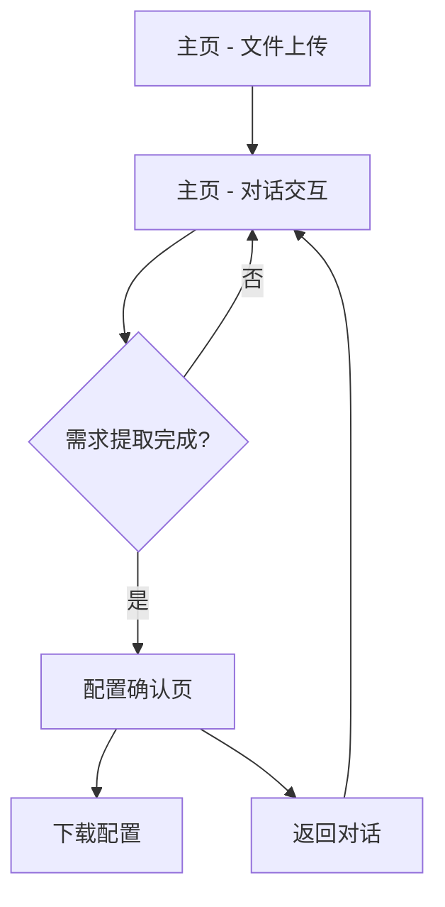

## 1. 产品概述
DeepSlide Assistant 前端界面现代化改版，将现有的 Streamlit 界面升级为更加现代、美观、精美的 React 前端应用，同时保留现有的 API 与文件工作流，并新增暗色模式支持。

## 2. 核心功能

### 2.1 用户角色
| 角色 | 注册方式 | 核心权限 |
|------|----------|----------|
| 普通用户 | 无需注册，直接使用 | 上传论文文件、参与对话、下载配置 |

### 2.2 功能模块
我们的前端改版包含以下主要页面：
1. **主页**: 文件上传、对话交互、进度展示。
2. **配置确认页**: 需求预览、确认操作、配置下载。

### 2.3 页面详情
| 页面名称 | 模块名称 | 功能描述 |
|----------|----------|----------|
| 主页 | 文件上传区 | 拖拽上传 .tex 文件，显示上传进度和文件名 |
| 主页 | 对话交互区 | 显示 AI 与用户的对话历史，支持实时输入 |
| 主页 | 状态指示器 | 显示当前状态（上传中/对话中/已完成） |
| 主页 | 暗色模式切换 | 一键切换明暗主题 |
| 配置确认页 | 需求预览 | 以卡片形式展示提取的配置信息 |
| 配置确认页 | 操作按钮 | 确认生成或返回继续对话 |
| 配置确认页 | 配置下载 | 下载 JSON 格式的配置文件 |

## 3. 核心流程
用户操作流程：
1. 用户进入主页，上传论文文件
2. 系统自动开始对话收集需求
3. 用户与 AI 进行多轮对话
4. 系统提取需求后进入确认页面
5. 用户确认需求并下载配置

## 4. 用户界面设计

### 4.1 设计风格
- **主色调**: 深蓝 (#1e40af) + 纯白 (#ffffff)
- **辅助色**: 浅灰 (#f8fafc) + 深灰 (#1f2937)
- **按钮样式**: 圆角矩形，悬停动画效果
- **字体**: Inter 字体族，标题 24-32px，正文 14-16px
- **布局**: 卡片式布局，左右分栏设计
- **图标**: 使用 Lucide React 图标库

### 4.2 页面设计概览
| 页面名称 | 模块名称 | UI 元素 |
|----------|----------|----------|
| 主页 | 文件上传区 | 拖拽区域带虚线边框，上传后显示绿色勾选 |
| 主页 | 对话交互区 | 聊天气泡设计，用户右对齐，AI 左对齐 |
| 主页 | 状态指示器 | 顶部进度条，状态标签带图标 |
| 配置确认页 | 需求卡片 | 阴影效果，分组展示配置项 |
| 配置确认页 | 操作按钮 | 主按钮蓝色，次要按钮灰色 |

### 4.3 响应式设计
- 桌面优先设计，支持 1200px 以上最佳体验
- 平板适配：768px-1199px，侧边栏变为顶部导航
- 移动端：低于 768px，单列布局，对话区域全屏

### 4.4 暗色模式
- 背景：深灰 (#0f172a)
- 卡片：中灰 (#1e293b)
- 文字：浅灰 (#e2e8f0)
- 强调色：亮蓝 (#3b82f6)
- 自动检测系统主题偏好