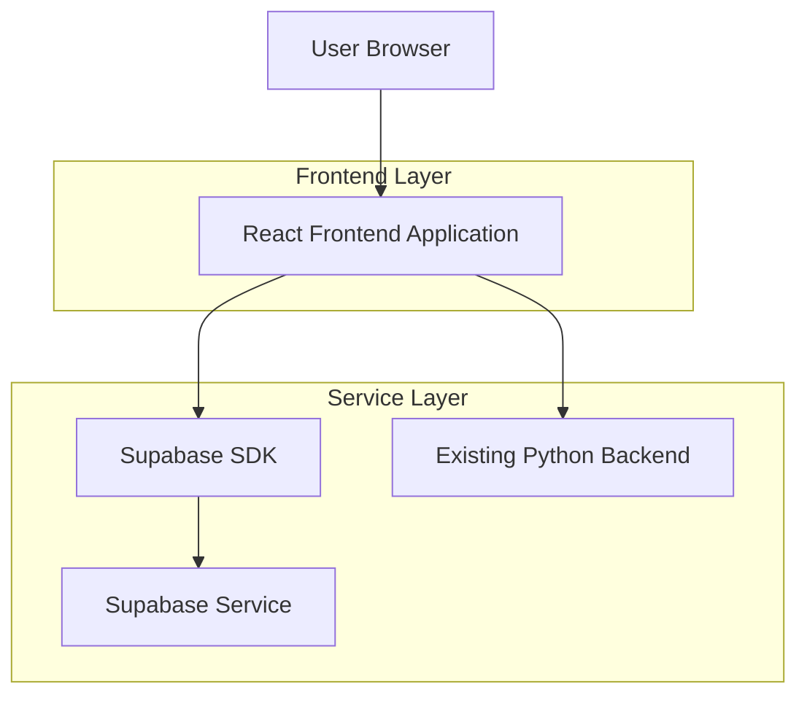
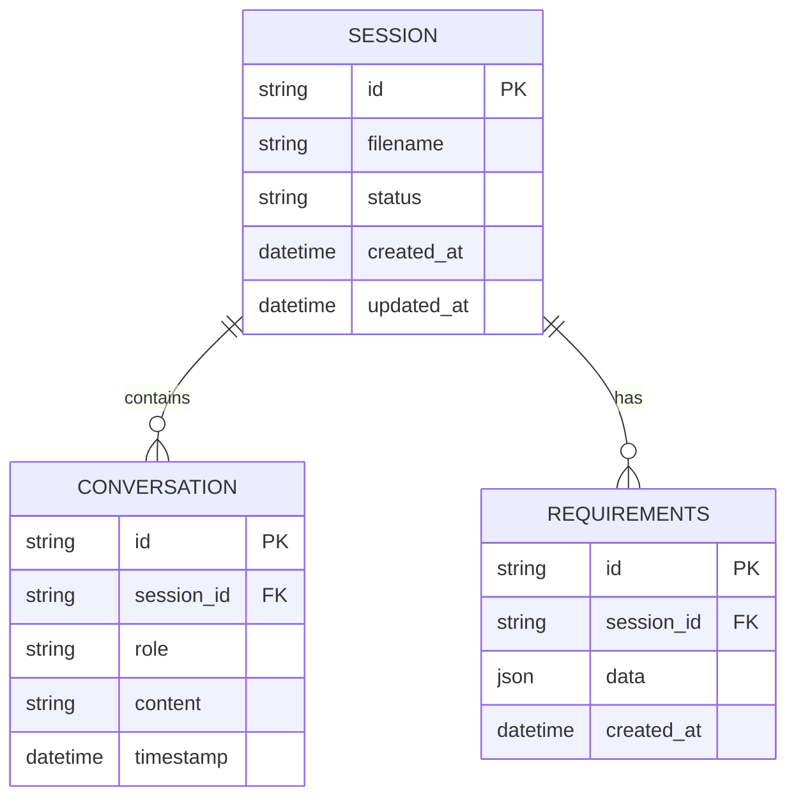

## 1. 架构设计



## 2. 技术描述
- 前端：React@18 + tailwindcss@3 + vite
- 初始化工具：vite-init
- 后端：保留现有 Python 后端服务
- 数据库：Supabase (PostgreSQL)
- 状态管理：React Context + useState
- UI 组件：shadcn/ui + Lucide React
- 动画库：framer-motion

## 3. 路由定义
| 路由 | 用途 |
|------|------|
| / | 主页，文件上传和对话交互 |
| /confirm | 配置确认页面，展示提取的需求 |
| /download | 配置下载页面，提供 JSON 文件下载 |

## 4. API 定义

### 4.1 文件上传 API
```
POST /api/upload
```

请求：
| 参数名 | 参数类型 | 是否必需 | 描述 |
|--------|----------|----------|------|
| file | File | 是 | .tex 文件 |

响应：
| 参数名 | 参数类型 | 描述 |
|--------|----------|------|
| success | boolean | 上传状态 |
| filename | string | 文件名 |
| session_id | string | 会话 ID |

### 4.2 对话交互 API
```
POST /api/conversation
```

请求：
| 参数名 | 参数类型 | 是否必需 | 描述 |
|--------|----------|----------|------|
| session_id | string | 是 | 会话 ID |
| message | string | 是 | 用户消息 |

响应：
| 参数名 | 参数类型 | 描述 |
|--------|----------|------|
| reply | string | AI 回复 |
| requirements | object | 提取的需求 |
| status | string | 对话状态 |

### 4.3 配置获取 API
```
GET /api/requirements/:session_id
```

响应：
| 参数名 | 参数类型 | 描述 |
|--------|----------|------|
| requirements | object | 完整的需求配置 |
| conversation_history | array | 对话历史 |

## 5. 数据模型

### 5.1 数据模型定义


### 5.2 数据定义语言
会话表 (sessions)
```sql
CREATE TABLE sessions (
  id UUID PRIMARY KEY DEFAULT gen_random_uuid(),
  filename VARCHAR(255) NOT NULL,
  status VARCHAR(50) DEFAULT 'uploading',
  created_at TIMESTAMP WITH TIME ZONE DEFAULT NOW(),
  updated_at TIMESTAMP WITH TIME ZONE DEFAULT NOW()
);

CREATE INDEX idx_sessions_status ON sessions(status);
CREATE INDEX idx_sessions_created_at ON sessions(created_at DESC);
```

对话表 (conversations)
```sql
CREATE TABLE conversations (
  id UUID PRIMARY KEY DEFAULT gen_random_uuid(),
  session_id UUID REFERENCES sessions(id) ON DELETE CASCADE,
  role VARCHAR(20) NOT NULL CHECK (role IN ('user', 'assistant')),
  content TEXT NOT NULL,
  timestamp TIMESTAMP WITH TIME ZONE DEFAULT NOW()
);

CREATE INDEX idx_conversations_session_id ON conversations(session_id);
CREATE INDEX idx_conversations_timestamp ON conversations(timestamp DESC);
```

需求表 (requirements)
```sql
CREATE TABLE requirements (
  id UUID PRIMARY KEY DEFAULT gen_random_uuid(),
  session_id UUID REFERENCES sessions(id) ON DELETE CASCADE,
  data JSONB NOT NULL,
  created_at TIMESTAMP WITH TIME ZONE DEFAULT NOW()
);

CREATE INDEX idx_requirements_session_id ON requirements(session_id);
```

### 5.3 Supabase 权限设置
```sql
-- 匿名用户权限
GRANT SELECT ON sessions TO anon;
GRANT SELECT ON conversations TO anon;
GRANT SELECT ON requirements TO anon;

-- 认证用户权限
GRANT ALL PRIVILEGES ON sessions TO authenticated;
GRANT ALL PRIVILEGES ON conversations TO authenticated;
GRANT ALL PRIVILEGES ON requirements TO authenticated;

-- RLS 策略
ALTER TABLE sessions ENABLE ROW LEVEL SECURITY;
ALTER TABLE conversations ENABLE ROW LEVEL SECURITY;
ALTER TABLE requirements ENABLE ROW LEVEL SECURITY;

CREATE POLICY "Allow anonymous read" ON sessions FOR SELECT USING (true);
CREATE POLICY "Allow authenticated full access" ON sessions FOR ALL USING (auth.role() = 'authenticated');
```