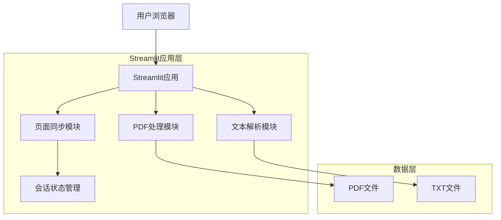
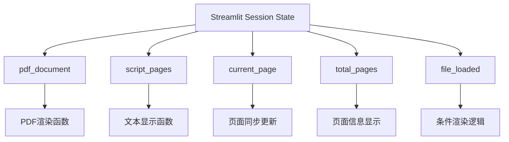

## 1. 架构设计



## 2. 技术描述

- **前端框架**: Streamlit@1.28+
- **PDF处理**: pdfplumber@0.9+ 或 PyPDF2@3.0+
- **文本处理**: Python标准库
- **图像处理**: Pillow@10.0+
- **会话管理**: Streamlit Session State
- **部署方式**: Streamlit Cloud 或本地部署

## 3. 路由定义

Streamlit为单页应用，通过条件渲染实现不同功能模块：

| 模块 | 路由逻辑 | 用途 |
|------|----------|------|
| 文件上传 | 默认显示 | 用户上传或选择示例文件 |
| 主查看器 | 文件加载后显示 | PDF和演讲稿同步展示 |

## 4. 核心模块设计

### 4.1 PDF处理模块
```python
def load_pdf(file_path):
    """加载PDF文件并返回页面对象列表"""
    # 使用pdfplumber提取PDF页面
    # 返回页面图像和页数信息

def render_pdf_page(pdf_doc, page_num, container_width):
    """渲染指定PDF页面为图像"""
    # 根据容器宽度计算缩放比例
    # 返回PIL图像对象
```

### 4.2 文本解析模块
```python
def parse_script(text_content):
    """解析演讲稿文本，按<next>标签分割"""
    # 按<next>标签分割文本
    # 返回页面列表

def get_current_script_page(script_pages, current_page):
    """获取当前页对应的演讲稿内容"""
    # 返回当前页的文本内容
```

### 4.3 页面同步模块
```python
def sync_page_change(direction):
    """处理页面切换逻辑"""
    # 更新当前页码
    # 触发PDF和演讲稿重新渲染

def handle_navigation_event(event_type):
    """处理不同导航事件（按钮、滚轮、键盘）"""
    # 统一处理各种导航方式
```

## 5. 会话状态管理



## 6. 数据模型

### 6.1 会话状态结构
```python
# Streamlit会话状态定义
st.session_state = {
    'pdf_document': None,      # PDF文档对象
    'script_pages': [],        # 演讲稿页面列表
    'current_page': 1,         # 当前页码
    'total_pages': 0,          # 总页数
    'file_loaded': False,      # 文件加载状态
    'pdf_images': []           # 预渲染的PDF页面图像
}
```

### 6.2 文件处理流程
```python
# 文件上传处理
def handle_file_upload(pdf_file, txt_file):
    if pdf_file is not None:
        # 保存PDF文件到临时位置
        pdf_path = save_uploaded_file(pdf_file)
        # 加载PDF文档
        st.session_state.pdf_document = load_pdf(pdf_path)
    
    if txt_file is not None:
        # 读取文本内容
        text_content = txt_file.read().decode('utf-8')
        # 解析演讲稿
        st.session_state.script_pages = parse_script(text_content)
    
    # 更新状态
    if pdf_file and txt_file:
        st.session_state.file_loaded = True
        st.session_state.total_pages = len(st.session_state.script_pages)
```

## 7. 性能优化策略

### 7.1 图像缓存
- 预渲染常用页面尺寸（如800px、1200px宽度）
- 使用LRU缓存策略管理内存中的PDF图像
- 支持按需加载大尺寸页面

### 7.2 延迟加载
- 初始只加载当前显示页面
- 后台预加载相邻页面（±2页）
- 用户快速翻页时优先显示低分辨率预览

### 7.3 内存管理
- 定期清理不再使用的PDF图像缓存
- 限制同时缓存的页面数量（建议20页）
- 文件切换时完全清理旧数据

## 8. 错误处理

### 8.1 文件格式验证
- PDF文件格式检查和损坏检测
- 文本文件编码检测和转换
- 文件大小限制（建议PDF<100MB，TXT<10MB）

### 8.2 异常情况处理
- PDF页面提取失败时显示错误信息
- 演讲稿解析错误时提供格式说明
- 文件加载超时处理（建议30秒超时）

### 8.3 用户体验优化
- 加载进度条显示
- 错误提示信息本地化（中文）
- 提供重新上传的快捷方式