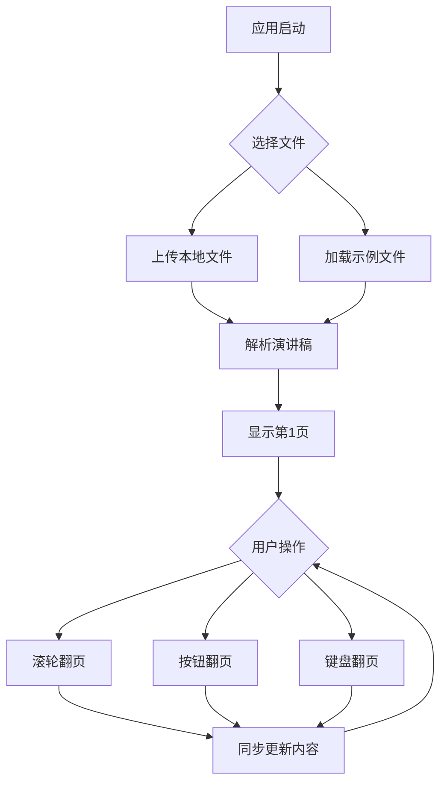

## 1. 产品概述
将现有的基于HTML/CSS/JavaScript的DeepSlide Viewer迁移到Streamlit平台，实现PDF页面与演讲稿的同步展示。产品主要解决演讲时PDF幻灯片与对应演讲稿的同步问题，帮助演讲者更好地掌控演讲节奏。

目标用户：需要进行技术演讲、学术报告或教学演示的演讲者。通过同步展示PDF页面和对应的演讲稿内容，提升演讲流畅度和专业性。

## 2. 核心功能

### 2.1 用户角色
| 角色 | 注册方式 | 核心权限 |
|------|----------|----------|
| 访客用户 | 无需注册 | 上传本地PDF和TXT文件，进行同步查看 |

### 2.2 功能模块
Streamlit查看器包含以下核心页面：
1. **主查看页面**：PDF展示区域、演讲稿显示面板、页面导航控制
2. **文件上传页面**：PDF文件上传、演讲稿文本文件上传

### 2.3 页面详情
| 页面名称 | 模块名称 | 功能描述 |
|----------|----------|----------|
| 主查看页面 | PDF展示区域 | 渲染并显示PDF页面，支持缩放适配容器宽度 |
| 主查看页面 | 演讲稿面板 | 显示当前页对应的演讲稿内容，支持文本换行 |
| 主查看页面 | 页面导航 | 上一页/下一页按钮，键盘快捷键支持 |
| 主查看页面 | 页面信息 | 显示当前页码和总页数 |
| 文件上传页面 | 文件选择器 | 支持选择本地PDF和TXT文件 |
| 文件上传页面 | 示例文件加载 | 快速加载内置的sample.pdf和sample.txt |

## 3. 核心流程
用户操作流程：
1. 用户访问应用，选择上传本地文件或加载示例文件
2. 系统自动解析演讲稿文本，按<next>标签分割成页面
3. 用户通过鼠标滚轮、按钮或键盘控制页面切换
4. PDF页面和演讲稿内容同步更新

## 4. 用户界面设计

### 4.1 设计风格
- **主色调**：深色主题，背景色#0b0b0b，面板色#141414
- **辅助色**：边框色#2a2a2a，文本色#eaeaea，次要文本#b5b5b5
- **按钮样式**：圆角矩形，背景色#1c1c1c，悬停效果#2a2a2a
- **字体**：系统默认字体，Inter或Segoe UI，字号14-16px
- **布局**：左右分栏布局，左侧演讲稿面板(360px)，右侧PDF展示区域

### 4.2 页面设计概述
| 页面名称 | 模块名称 | UI元素 |
|----------|----------|----------|
| 主查看页面 | PDF展示区域 | 深色背景，PDF内容居中显示，最大宽度100% |
| 主查看页面 | 演讲稿面板 | 圆角卡片设计，白色文本，行高1.7，预留16px内边距 |
| 主查看页面 | 导航控制 | 圆角按钮，水平排列，包含上一页/下一页 |
| 文件上传页面 | 文件选择器 | Streamlit原生文件上传组件，支持拖拽 |

### 4.3 响应式设计
桌面优先设计，支持窗口大小调整时PDF内容自动重新渲染适应新尺寸。

## 5. 技术特性
- **PDF渲染**：基于pdfplumber或PyPDF2库进行PDF页面提取
- **文本解析**：支持UTF-8编码，按<next>标签智能分割演讲稿
- **同步机制**：页面切换时同时更新PDF和演讲稿内容
- **性能优化**：预加载相邻页面，减少切换延迟