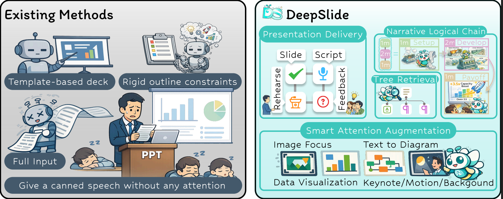
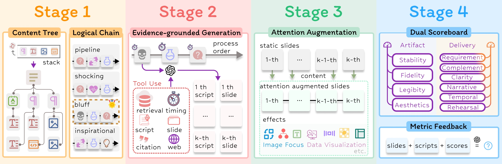
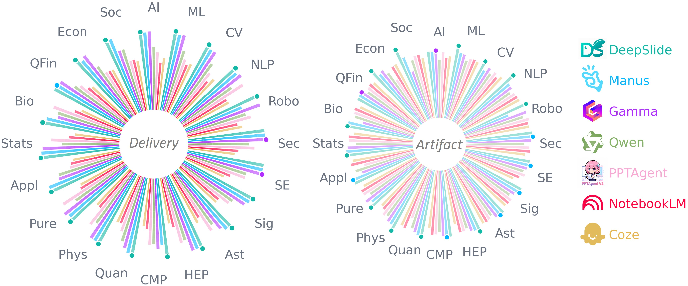
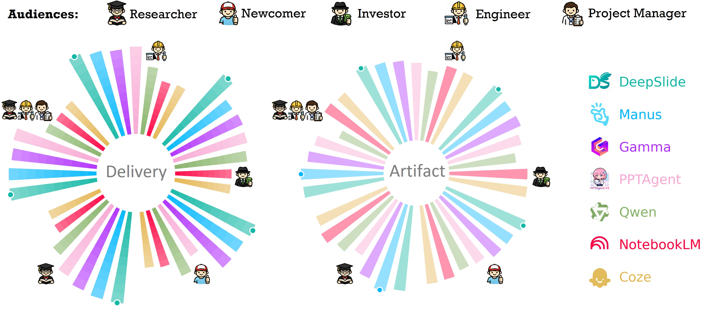
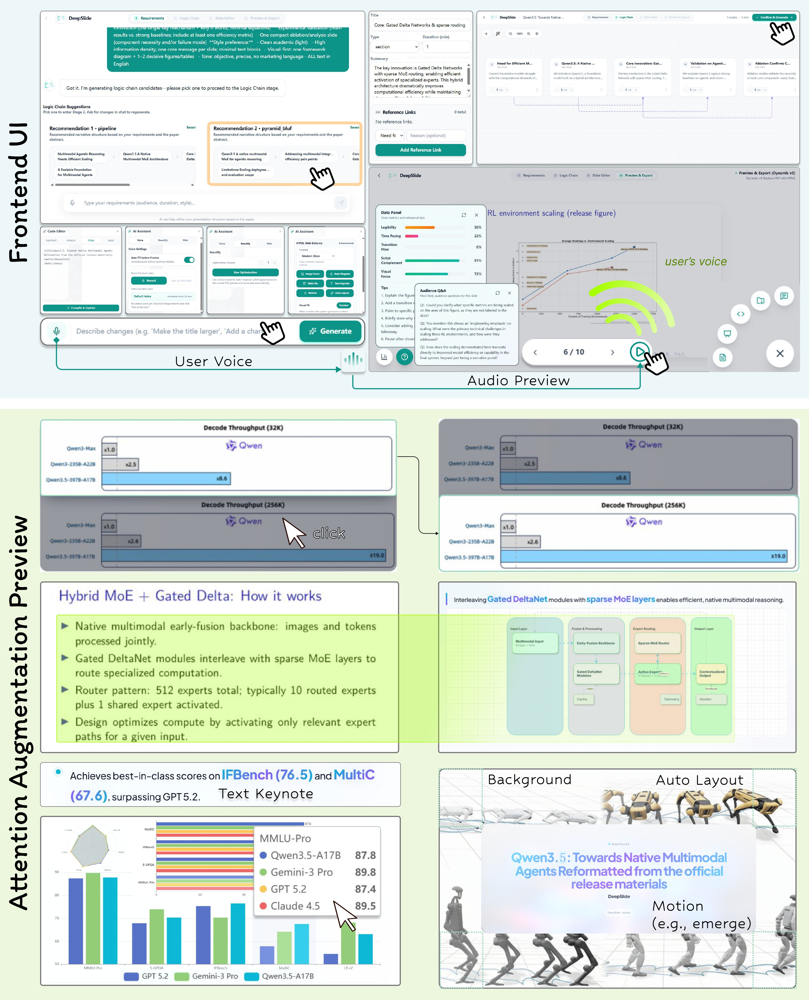
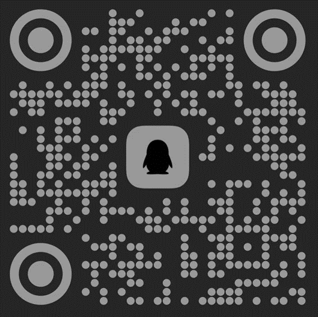

# DeepSlide: From Artifacts to Presentation Delivery

<div align="center">

[]()    [](https://github.com/PUITAR/DeepSlide)

Our detailed technical report will be published soon.

</div>

> DeepSlide is not a tool that “quickly makes a PPT for you”, but a **human-in-the-loop system for full presentation delivery (delivery-first)**.

**🌐 Chinese Version:** [README_zh.md](./README_zh.md)

---

<div align="center">

🎥 Bilibili: https://www.bilibili.com/video/BV1sSPkz9E6P
<!-- [](https://www.bilibili.com/video/BV1sSPkz9E6P) -->

▶️ YouTube: https://youtu.be/NGqFLT81uHA

[](https://youtu.be/NGqFLT81uHA)

</div>

## Key Claim

A high-quality talk is not mainly determined by whether the static slides “look nice”. What matters more is whether information is organized and delivered under **audience cognition and attention constraints**—including narrative coherence, timing and pacing control, attention guidance, and rehearsal readiness. In other words, **artifact quality ≠ delivery quality**.

<p align="center">
  
  <br/>
  <em><strong>Figure 1.</strong> Comparison with existing methods: DeepSlide targets end-to-end presentation delivery rather than deck authoring only.</em>
</p>

---

## A Four-Stage End-to-End Pipeline (Delivery-First)

To this end, DeepSlide proposes a **four-stage end-to-end pipeline**: requirement clarification & narrative proposals → logical-chain editing & evidence-grounded generation → interactive enhancement & attention control → rehearsal & evaluation. This shifts presentation preparation from improving artifact quality to improving delivery quality.

- **Controllable narrative strategy**: generates multiple time-budgeted logical-chain candidates, supports node-level editing and emphasis allocation  
- **Co-delivery of script and slides**: produces both `recipe/content.tex` (slides) and `recipe/speech.txt` (script)  
- **In-talk attention strategies**: optional enhancements such as content-aware image focus, table visualization, and text-to-diagram  
- **Rehearsal guidance**: provides voice preview and simulates audience questions with actionable suggestions  

---

## Four-Stage Framework

<p align="center">
  
  <br/>
  <em><strong>Figure 2.</strong> Overview of the four-stage framework: a closed-loop delivery workflow from requirement clarification to generation/enhancement, and finally rehearsal/evaluation.</em>
</p>

To better evaluate from both artifact quality and delivery quality, we developed an LLM-based **dual-scoreboard evaluation**, and compared against a set of existing methods:

<p align="center">
  
  <br/>
  <em><strong>Figure 3.</strong> Dual-scoreboard results across 20 domains (Artifact vs. Delivery).</em>
</p>

<p align="center">
  
  <br/>
  <em><strong>Figure 4.</strong> Dual-scoreboard results under mixed role settings (Artifact vs. Delivery).</em>
</p>

---

## System Overview

<p align="center">
  
  <br/>
  <em><strong>Figure 5.</strong> System UI and key capabilities: logical-chain editing, evidence-grounded generation, interactive enhancement, and a rehearsal loop.</em>
</p>

---

## Core Ideas

The paper argues that existing “slide agents / generators” typically reduce the cost of deck authoring, but still fail to cover the full burden of talk preparation. There are three main gaps:

- **Lack of selectable, editable narrative strategies**: many systems either skip narrative planning or output only a single generic outline, with weak personalization and no controllable timing/emphasis allocation  
- **Lack of in-talk attention strategies**: most systems deliver static decks without content-aware attention guidance (focus, progressive reveal, expressive encoding for dense charts)  
- **Lack of rehearsal support**: they stop at generating pages, without slide-aligned non-redundant scripts, rehearsal feedback, or preparedness for on-stage Q&A  

DeepSlide’s methodology is: the presenter only needs to lock in high-level decisions (audience, total duration, goals, style intent, narrative skeleton, and emphasis allocation). The system then executes the rest under controllable constraints, forming an iterative delivery loop. This is implemented as four stages:

- **Stage 1: Requirement clarification & narrative proposals**: collect requirements via open-ended dialog and output multiple time-budgeted logical-chain candidates  
- **Stage 2: Logical-chain editing & evidence-grounded generation**: node-level edits (reorder/add/remove/rewrite/timing/cross-reference), retrieve evidence from source material, and generate slides + script  
- **Stage 3: Interactive enhancement & attention control**: provide content-aware optional enhancements (focus, table visualization, text-to-diagram, auto layout, etc.)  
- **Stage 4: Rehearsal & evaluation**: audience-view rehearsal (optional audio), actionable revision suggestions, and one-click export of deliverables  

---

## Architecture and Code

The core implementation lives in `deepslide/`, and runtime consists of three services:

- `deepslide/backend`: FastAPI (parsing, generation, compilation, export, evaluation entrypoints)  
- `deepslide/frontend`: Vite + React (interactive editing, preview, dialog entrypoints)  
- `next-ai-draw-io`: Next.js (diagrams and draw.io capabilities)  

```text
DeepSlide/
├── deepslide/
│   ├── backend/
│   ├── frontend/
│   ├── env.md               # Model/Agent env vars overview
│   ├── install.sh           # Dependency install script (shortcut)
│   ├── start.sh             # One-click start for all 3 services
│   ├── stop.sh              # One-click stop
│   └── clear.sh             # Clear caches/artifacts (dangerous: deletes projects)
├── experiments/             # Evaluation reproduction (dual-scoreboard / ablations)
├── DeepSlide-Arxiv/         # Paper artifact directory (figures/tables/latex)
├── assets/                  # README assets (synced from the paper)
└── README_zh.md
```

---

## Prerequisites

- Linux/macOS (recommended)  
- Python 3.10+ (3.12 recommended)  
- Node.js 18+ (20 LTS recommended)  
- npm 9+  
- LaTeX (for Beamer: `xelatex` + beamer packages). Strongly recommended to use the provided `container/dockerfile` so you don’t need to install TeX locally.  

---

## Local Setup and Run (Recommended)

### 0) Run with Docker

This repo provides `container/dockerfile` with TeXLive and Python. You can use Docker to get a ready-to-use TeX compile environment without installing TeX locally:

```bash
docker build -t deepslide:latest -f container/dockerfile .

docker run -it --rm \
  -v "$(pwd)":/app \
  -p 5173:5173 -p 8001:8001 -p 6002:6002 \
  deepslide:latest bash
```

Inside the container, run the same steps below under `/app` (or directly run `deepslide/start.sh`).

### 1) Install Dependencies

```bash
cd next-ai-draw-io
npm install
cd ..

cd deepslide/backend
python3 -m venv .venv
source .venv/bin/activate
pip install --upgrade pip
pip install -r requirements.txt
cd ../..

cd deepslide/frontend
npm install
cd ../..
```

You may also use the shortcut script (still recommended to prepare venv/permissions first): `bash deepslide/install.sh`.

### 2) Configure Models and Ports

Edit `deepslide/.env`. See `deepslide/env.md` for detailed model environment variables.

### 3) One-Click Start

```bash
cd deepslide
bash start.sh
```

Default endpoints (ports can be changed in `.env`):

- Frontend: `http://127.0.0.1:5173`  
- Backend API: `http://127.0.0.1:8001/api/v1`  
- Backend Docs: `http://127.0.0.1:8001/docs`  
- next-ai-draw-io: `http://127.0.0.1:6002`  

Stop all services:

```bash
cd deepslide
bash stop.sh
```

---

## Configuration: Models and Ports

### Minimal Working Configuration

Replace the key with your own value; do not commit real keys.

```bash
# Default text LLM
DEFAULT_MODEL_PLATFORM_TYPE=openai
DEFAULT_MODEL_TYPE=gpt-4o-mini
DEFAULT_MODEL_API_URL=https://api.openai.com/v1
DEFAULT_MODEL_API_KEY=YOUR_API_KEY

# Dev Ports
BACKEND_PORT=8001
FRONTEND_PORT=5173
NEXT_AI_DRAWIO_PORT=6002
```

### Agent-Level Overrides (Recommended)

DeepSlide supports configuring different provider/model/base_url/api_key for different Agents, so you can use cheaper models for simple steps and stronger models for hard steps. See `deepslide/env.md` for the full list of fields and Agent names.

---

## Scripts (start/stop/clear/install)

### `deepslide/start.sh`

- Reads `deepslide/.env`  
- Starts three services: `next-ai-draw-io`, backend `uvicorn`, frontend `vite`  
- Writes PIDs into `deepslide/.pids/` for stop/cleanup  

### `deepslide/stop.sh`

- Stops services via PID files first  
- Falls back to process-pattern kill (backend/frontend/next-ai-draw-io)  

### `deepslide/clear.sh` (Dangerous)

Resets runtime state by cleaning caches and generated artifacts (including projects, uploads, and ASR/TTS intermediates). Do not run it if you want to keep project results.

### `deepslide/install.sh`

Installs backend/frontend/next-ai-draw-io dependencies (shortcut script).

---

## Workflow: From Materials to Delivery

1. Open the frontend and create a project  
2. Upload materials (paper PDF / LaTeX zip / multi-doc references)  
3. Finish requirement clarification (audience, total duration, goal, style preference)  
4. Inspect and choose one of the narrative logical-chain candidates (editable timing/emphasis allocation)  
5. Generate slides + script: produce `recipe/content.tex` and `recipe/speech.txt`  
6. Compile/preview and apply interactive enhancements (focus, visualization, diagrams, auto layout, etc.)  
7. Enter the rehearsal loop: preview metrics, revision suggestions, audience-question simulation (Stage 4)  
8. Export deliverables (PDF / PPTX / ZIP)  

---

## Experiments and Evaluation Reproduction

The evaluation code is under `experiments/`. The core idea is a dual-scoreboard: distinguishing static artifact quality (Artifact) vs. delivery quality (Delivery).

### Prerequisite: Install evaluation dependencies

It is recommended to create a dedicated venv for evaluation:

```bash
python3 -m venv experiments/.venv
source experiments/.venv/bin/activate
pip install --upgrade pip
pip install -r experiments/main/requirements.txt
```

### Prerequisite: Configure evaluation environment variables

Copy and fill:

- `experiments/main/.env.template` → `experiments/main/.env`

It includes:

- **LLM Judge** (for subjective metrics)  
- **OCR** (default uses VLM for OCR; can be disabled)  

### One-click reproduction: main evaluation (main)

```bash
source experiments/.venv/bin/activate
python experiments/main/run_oneclick.py
```

Outputs are typically under `experiments/main/outputs/` (scores / reports, etc.).

### One-click reproduction: role evaluation (role)

```bash
source experiments/.venv/bin/activate
python experiments/role/run_oneclick.py
```

### Ablations (K/L/S)

The ablation entrypoint is `experiments/xr/run_eval.py`:

```bash
source experiments/.venv/bin/activate
python experiments/xr/run_eval.py scan
python experiments/xr/run_eval.py evaluate --judge llm --llm-mode packed
python experiments/xr/run_eval.py report
```

Notes:

- If you don’t configure OCR, run evaluate with `--require-ocr 0` or set `EVAL_OCR_MODE=off` (metrics depending on OCR will be affected)  
- If you don’t configure LLM judge, run with `--require-judge 0` (metrics requiring judge will be skipped)  

---

## Dependencies (next-ai-draw-io / index-tts)

### next-ai-draw-io

`deepslide/start.sh` starts this service. Before the first run, make sure you run `npm install` in `next-ai-draw-io/`.

### index-tts (Optional: voice preview / TTS)

The backend TTS logic calls `index-tts/index-tts-main` (and relies on the `uv` command). If you need voice preview, follow `index-tts/index-tts-main/README.md` to install and prepare checkpoints, and ensure `uv` is available in PATH.

---

## FAQ

- **Frontend can’t connect to backend**: check `BACKEND_PORT` and whether the backend is running; check if PID files exist under `deepslide/.pids/`  
- **next-ai-draw-io not running**: make sure dependencies are installed; default port is 6002  
- **LaTeX compilation fails**: ensure `xelatex` + beamer dependencies are present (or use the Docker environment); check missing fonts  
- **Evaluation errors about missing OCR / Judge**: configure `EVAL_MODEL_*` and `DEFAULT_VLM_*` in `experiments/main/.env.template`, or skip via `--require-ocr 0/--require-judge 0`  

---

## Community

<table align="center">
  <tr>
    <td align="center">
      
      <br/>
      <em>WeChat</em>
    </td>
    <td align="center">
      
      <br/>
      <em>QQ</em>
    </td>
  </tr>
</table>

---

## Paper and Citation

```


```
