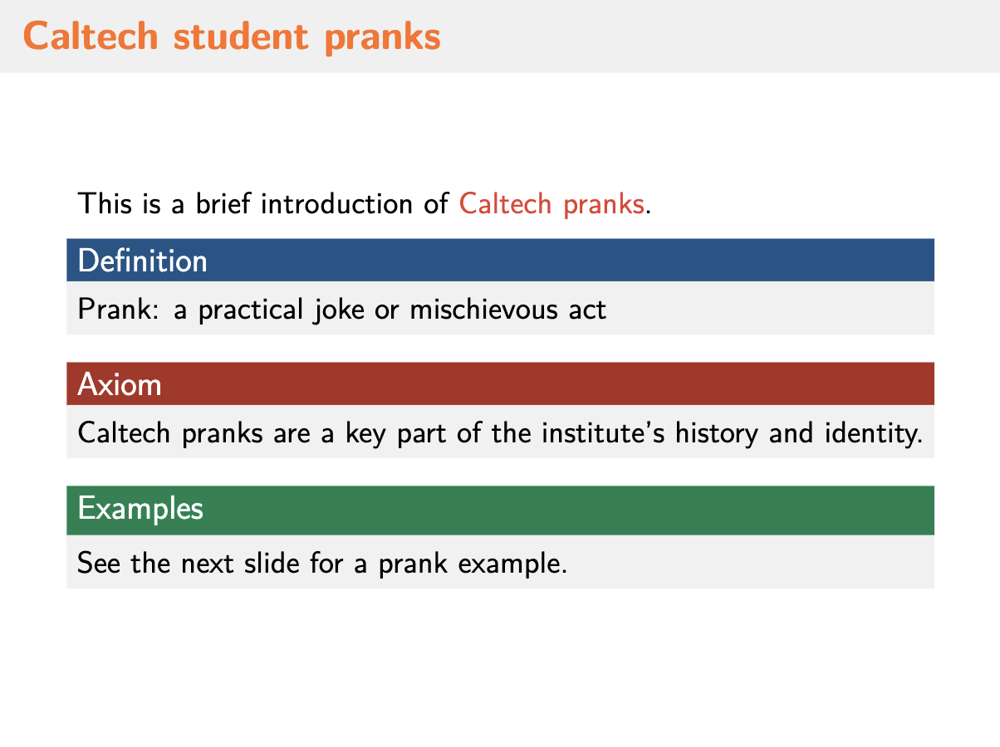
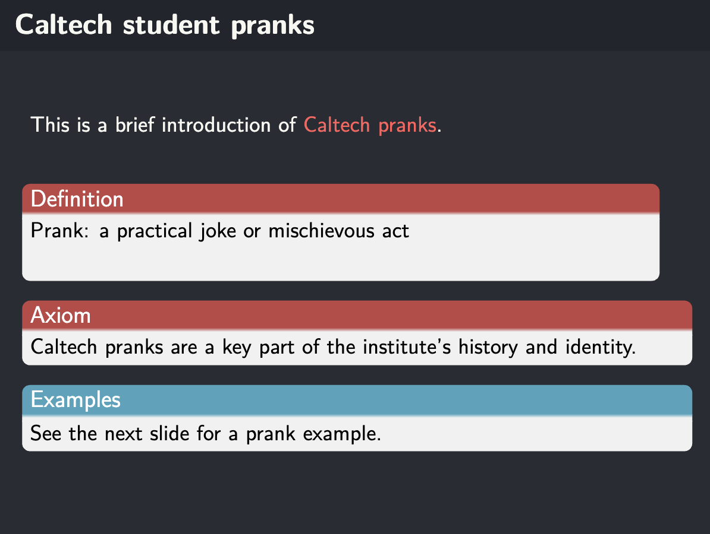

# Templater Agent

This document introduces the `Templater` agent implemented in `/home/ym/DeepSlide/deepslide/agents/templater.py`, its selection and modification workflow, and the test procedure in `/home/ym/DeepSlide/test/test_templater/test_templater.py`. Visual before/after differences are located at `/home/ym/DeepSlide/documents/assets/agents/templater`.

## Overview
- `Templater` provides two core functions:
  - `select`: Rewrite a user’s template description, retrieve similar beamer templates via embeddings, then ask the model to pick the best match and return the template name.
  - `modify`: Apply style modifications to a beamer template by editing `base.tex` according to user requirements.

## Model and Embeddings
- Uses `camel-ai` (`deepseek-chat`) via `ModelFactory` and `ChatAgent`.
- Embedding source:
  - Primary: `beamer_descriptions.tensordict.pt` under `/home/ym/DeepSlide/template/rag`.
  - Fallback: If the PT file is unavailable, hash-based embeddings are computed from each template’s `description.md`.
- Similarity metric: cosine similarity.

## Select Flow
1. Rewrite user description into a concise English paragraph (single output) using the model.
2. Embed the rewritten description and compute similarity against stored template vectors.
3. Load candidates’ `description.md`, then call the model to select the best template name from the top-K candidates.
4. Return only the template name.

## Modify Flow
1. Read `base.tex` from the given `base_dir`.
2. Prompt the model to modify style while preserving document structure and core includes (`title`, `content`, `ref`).
3. Expect the full file wrapped in `<base_tex>...</base_tex>`; if not, fallback to `<base>...</base>` or keep original.
4. Write back updated `base.tex`.

## Test Script
File: `/home/ym/DeepSlide/test/test_templater/test_templater.py`
- Steps:
  - Remove any existing `demo` directory.
  - Instantiate `Templater` using project config and directories.
  - Call `select` with an academic style description; copy selected template to `test/test_templater/demo`.
  - Call `modify` with three style requirements to refine `base.tex`.
  - Compile using `Compiler` with `max_try=3` and helper set to `{"file": "base"}`.

## Changes Made in Test

模板修改要求:
```bash
Make the following modifications to the template:

1. Unify all visual elements to ensure consistency in the style of images, illustrations, and icons, eliminating visual distractions.  
2. Strategically increase white space (negative space) to highlight key content and enhance the overall professionalism and quality of the page.  
3. Use high-contrast non-pure color backgrounds as the main theme, while employing highly saturated accent colors to emphasize data, optimizing both long-term viewing comfort and visual impact.
```

| 状态 | 截图 | 说明 |
| --- | --- | --- |
| 变更前 |  | 原始caltech模板 |
| 变更后 |  | 根据用户需求更新模板 |

## Notes
- If the embedding PT file is missing, selection still works via hash embeddings.
- The modify step is defensive; it preserves compilation structure and falls back if the model returns incomplete tags.
