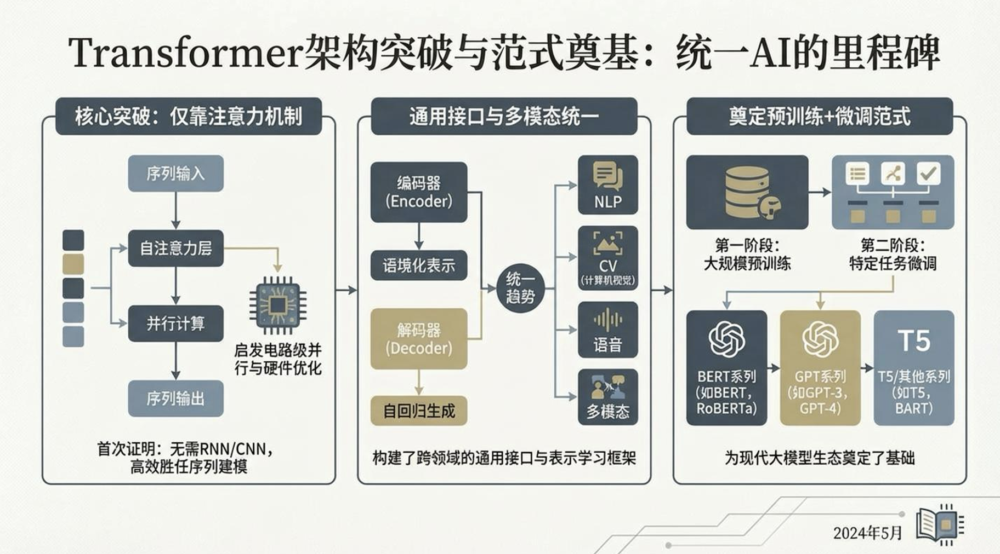
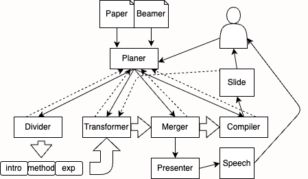

# 项目动机
尽管当前已存在一些多智能体slide端到端系统，例如kimi，gemini，nano banana等工具，能够针对用户给定提示词生成相应的slide。
也有相关研究工作[1]。然而它们普遍存在一些问题：
- 生成质量不高。以[**【kimi-1.5生辰的ppt（点击察看）】**](/home/ym/DeepSlide/kimi_ppt.pptx)为例：
    - 从文本上看：1️⃣ 可信度不高，常常伴有事实性错误；2️⃣ 结构逻辑散乱，缺乏逻辑性；3️⃣ 内容不围绕演讲重心，很难直接使用。
    - 从图片上看：由于多模态模型的发展，生成模型已经具备一些表现能力。然而，生成模型通常不具备对演讲内容的深刻理解，因此生成的图片往往无法用于说明。
<figure align="center">
  
  <figcaption>kimi-1.5 PPT 示例1</figcaption>
</figure>

- 现有方法，主要模型在文本摘要、文本理解、图片生成等技术在PPT上的表现能力，而忽略了生成出来的slide作为一个演讲材料应有的特点，以及与演讲者的关系。好的演讲材料应当以“人”为中心、以演讲为中心，充分考虑与演讲者的演讲过程结合。

# 项目目标
我们的目标是设计一个端到端的多轮对话多智能体slide生成系统，主要弥补现有方法存在上面提到的两点缺陷（技术与审美）：

> 系统构成：端到端系统 <=> 评估系统

总体来实现包含两部分：
1. 多智能体系统：能够在初始时刻接受一份参考材料和slide模板，并生成一份高质量的slide。并基于后续用户<u>多轮对话</u>进一步修改slide。考虑其中的交互与调度。
2. 评估系统：能够对生成slide进行评估，设计或使用现有的出能够对技术角度和审美角度进行评估的<u>量化指标</u>。
    - 技术角度：对slide生成过程中可能涉及的任务，例如文本摘要、文本改写、语义理解、图片生成质量、编译错误次数等进行评估。
    - 审美角度：对slide材料的软实力进行评估，例如 slide 材料的可读性、可理解性、吸引力等。再例如：是否可以结合章节/帧之间的联系性，是否可以结合材料长度以与演讲者的互动性。

NOTE：优先设计出多智能体系统，再设计出评估系统。根据评估结果改进多智能体系统。互相调整，互相迭代。

# 初步设计
<figure align="center">
  
  <figcaption>多智能体系统模块初步设计图</figcaption>
</figure>

> 图例说明：实现表示数据流、虚线表示可能存在的反馈。

- Planer：系统最核心的agent，需要具有一定的理解和规划能力，知道该调用四个其他agent，是所有agent沟通的桥梁。设计成树形结构是为了更稳定，也尽可能减少通信量。
- Divider：并不是材料中所有的章节需要包含在slide中，也不是所有slide中的章节材料中都有。divier需要有能够对内容进行模糊分配的能力。划分可以迭代进行，意味着章节内可以有其他章节。
- Transformer：对划分好的分块进行改写，这个过程中可能要planer对分块的演讲顺序进行合理排布。transformer的设计是最核心的，也是最终slide呈现技术水平高、审美水平好的关键。
- Merger：将改写后的分块合并到slide（暂定是`contant.tex`中）。需要通过frame来组织ppt分页。这里面需要考虑分块之间的关联联系，例如：章节与章节之间的联系，章节与帧之间的联系。
- Compiler：将`contant.tex`编译成pdf/ppt文件。结合编译信息，判断是否编译成功。如果编译成功，返回编译后的文件；如果编译失败，分析错误原因并上报给planer，由planer根据原因重新调整对应agent进行改正。
- Presenter: 根据Merger生成的slide生成演讲稿。需要考虑与演讲者的互动过程，例如：如何与演讲者互动、如何与演讲者沟通、如何与演讲者互动等。

初步分工：
- Compiler：杨铭
- Divider：浩森
- Merger：之蔚
- Presenter：佳航

# 其他说明
- **container/**：Docker 相关配置与镜像构建脚本，用于一键部署软件运行环境（早期开发时不需要关注）
- **data/**：存放原始参考材料（主要是从arxiv上爬取的latex论文代码，可以包含不同领域用于后续实验）
- **deepslide/**：核心 Python 包，内含 Planner、Divider、Transformer、Merger、Compiler 五大 Agent 的实现与调度逻辑。在后续开发过程中，每个人可能需要主要负责其中一个agent。强烈建议每个角色包含三部分主要内容：核心代码逻辑、使用说明书、测试用例。其中核心代码逻辑放在这个文件夹下。测试用例也可以放在这个文件夹下面。使用说明，放到根目录的documents下面。尽可能讲明白自己的设计和使用方法。直接用中文就好，如果目标是开源影响力项目，我们会提供多语言版本文档（后期统一翻译就行）。
- **documents/**：项目文档、需求说明、实验记录与评估报告。
- **requirements.txt**：项目依赖列表，确保环境一致。开发过程中用到的包请加入这个文件。为了避免影响其他同学使用服务器，在开发时请使用conda activate deepslide虚拟环境。
- **scripts/**：常用脚本集合，如数据预处理、批量测试、指标计算、Docker 启动/停止等、以及系统开发后的实验代码。请注意个人开发某个agent/模块的测试用例不要放到这个下面，以免混乱，这里放的是开源后重要的脚本，用于其他人直接使用的，或是重要的脚本。
- **template/**：LaTeX Beamer 模板与样式文件，供 Merger 生成 `content.tex` 时引用  
- **workspace/**：运行时工作区。各个agent对数据文件的改动不要污染data/template下面的文件，以免下次使用时被上次的操作影响。因此体统workspace概念，所有的模板/数据拷贝到这个目录下的某个项目（例如demo项目）下面。再让agent改动。

# 参考文献
[1] Zheng, H., Guan, X., Kong, H., Zhang, W., Zheng, J., Zhou, W., ... & Sun, L. (2025, November). Pptagent: Generating and evaluating presentations beyond text-to-slides. In Proceedings of the 2025 Conference on Empirical Methods in Natural Language Processing (pp. 14413-14429).

自动迭代的target ppt