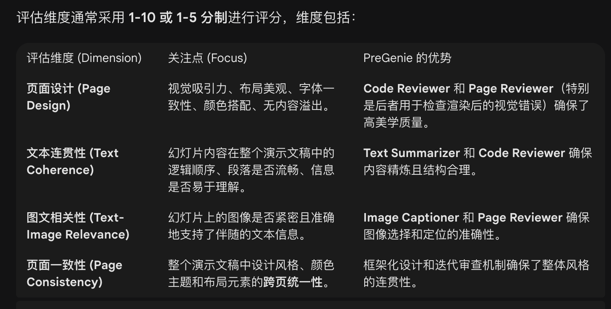
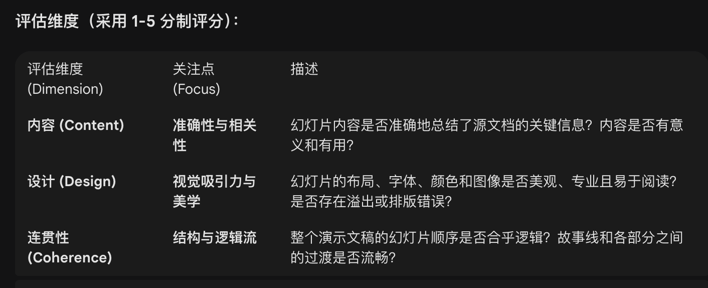
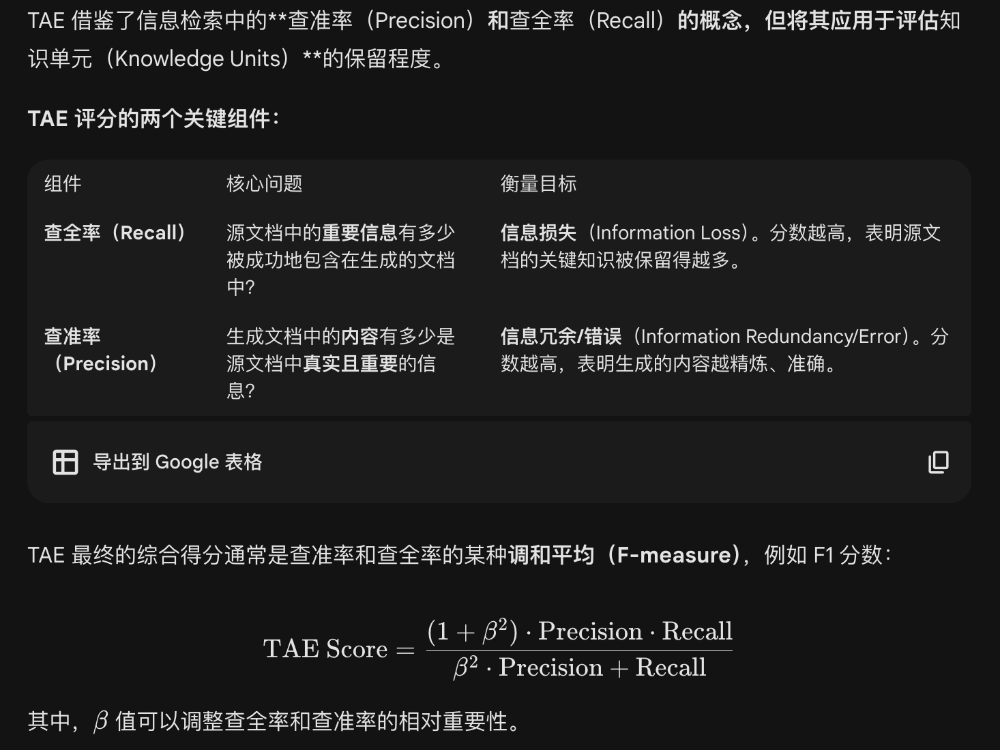
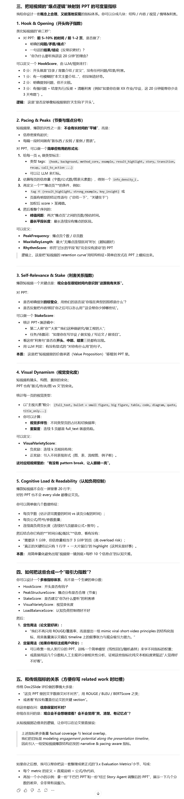

# AI slide 调研

基于大语言模型的最新方法可分为两类。
1. 直接利用扩散模型或图像条件模型生成幻灯片图像，虽然能产生视觉效果丰富的输出，但对结构控制和可编辑性的支持有限。
2. 先生成中间表示（如Markdown或HTML），再渲染为幻灯片。这种方法提升了版式可控性并支持后期编辑，但通常缺乏验证渲染视觉效果的机制。

# 相关工作和评测机制（9个工作）
- PASS: Presentation Automation for **Slide Generation and Speech**
    - SciDuet数据集：81篇论文
    - Coherence: To evaluate if there is a smooth and logical transition from one slide to another.
    - Redundancy: To evaluate if there is unnecessary repetition of information across slides. 
    - Relevance: To evaluate if each slide content is relevant to the specified topic.
    - LLM 评测
- Auto-Slides: An Interactive Multi-Agent System for Creating and Customizing Research Presentations
    - i）交互式编辑功能对学习者理解力、掌控感与参与度的提升效果（第4.2节）；
    - ii）幻灯片学习模式与LLM聊天学习模式的对比研究（第4.3节）；
    - iii）叙事结构优化对幻灯片感知质量的影响（第4.4节）；
    - iv）增强型解析代理与验证调整代理对结构化信息保真度与事实准确性的改进作用（第4.5节）。
    - 人类打标
- Presentations by the Humans and For the Humans: Harnessing LLMs for Generating Persona-Aware Slides from Documents
    - 自动化+人工
    - Persona-Aware-D2S-Dataset数据集
    - 自动：
        - ROUGE (Recall-Oriented Understudy for Gisting Evaluation)：常用于评估自动生成的摘要（幻灯片内容可视为摘要）与参考摘要的重叠度，衡量信息召回率和精确度。
        - BLEU (Bilingual Evaluation Understudy)：虽然最初用于机器翻译，但也常用于衡量生成文本与参考文本之间的相似性。
        - 信息覆盖和抽取指标（Information Coverage and Extraction Metrics）: 评估生成的幻灯片内容是否有效地涵盖了源文档中的关键信息。
    - 人工：
        - 信息量/内容相关性 (Informativeness/Content Relevance)
        - 个性化感知/受众适应性 (Persona Awareness/Audience Adaptation)
        - 演示时长适应性 (Duration Suitability):
        - 连贯性 (Coherence) 和流畅性 (Fluency)

- PPTC Benchmark: Evaluating Large Language Models for PowerPoint Task Completion
    - 自动计算
    - 轮次准确率
    $  \text{Turn Accuracy} = \frac{\text{Correctly Completed Turns}}{\text{Total Turns}}$
    - 会话准确率
    $  \text{Session Accuracy} = \frac{\text{Correctly Completed Sessions}}{\text{Total Sessions}}$
- PreGenie: An Agentic Framework for High-quality Visual Presentation Generation
    1. 传统自动指标 (Traditional Automated Metrics)
        这类指标主要衡量生成的文本内容与源文档文本或“黄金标准”摘要之间的相似度。

        - 文本相似度 (Text Similarity)
            - ROUGE-L (Recall-Oriented Understudy for Gisting Evaluation - Longest Common Subsequence): 衡量模型生成的摘要（幻灯片文本）与参考摘要（源文档关键信息）之间的重叠度。分数越高，表示内容覆盖率和准确性越好。
            - Coverage: 衡量生成的文本是否有效涵盖了源文档中的关键信息。

        - 成功率 (Success Rate - SR):

            - 衡量模型成功生成所有幻灯片，且没有出现代码错误或渲染错误的比例。PreGenie 由于使用了Code Reviewer和Page Reviewer的智能体机制，因此这个指标通常较高。

    2. 多模态一致性指标 (Multimodal Consistency Metrics)
    PreGenie 能够处理图文输入并生成带有图片的演示文稿，因此需要评估图片和文本是否匹配。

        - 文本-图像相关性 (Text-Image Relevance)    
            - CLIP Score / LongClip Score: 使用视觉语言模型（VLM）来量化幻灯片上的文本和图片之间的语义相关性。分数越高，表示图片与文字内容越匹配，越能辅助观众理解。

        - 图像比例 (Figure Proportion):
            - 衡量源文档中相关图像被成功包含在最终演示文稿中的比例。这是一个重要的指标，因为它确保了多模态输入的有效利用。

    3. 工评估与 LLM 评估 (Human and LLM Evaluation)
        这是衡量“高质量视觉演示文稿”最关键的部分，它侧重于主观的设计美学和整体体验。论文通常使用 GPT-4o（或其他强大的 LLM）作为评估法官，并结合人类评估员进行评分。

        <figure align="center">
            
            <figcaption>人类标注指标</figcaption>
        </figure>

- PPTAGENT: Generating and Evaluating Presentations Beyond Text-to-Slides (EMNLP 2025)
    - MLLM-as-a-Judge 多模态大模型评测
        <figure align="center">
            
            <figcaption>多模态大模型评测指标</figcaption>
        </figure>
            
        - PPTEVAL 平均分 (Avg. PPTEVAL Score):

            $$  
            \text{Avg. Score} = \frac{\sum (\text{Content Score} + \text{Design Score} + \text{Coherence Score})}{\text{Total Presentations} \times 3}
            $$
            
        - 人类评估验证: 论文通过人工评估来验证 MLLM-as-a-Judge 评估结果的可靠性和有效性，确保 MLLM 的评分与人类感知相一致。
    
    - 鲁棒性与生成成功率  
      **成功率 (Success Rate, SR)**  
      - 定义：成功生成所有幻灯片、且在生成过程中没有代码或渲染错误的演示文稿所占的百分比。  
      - 计算：  
        $$ \text{SR} = \frac{\text{成功生成的演示文稿数量}}{\text{总演示文稿数量}} \times 100\% $$

    - 文本内容质量  
      **困惑度 (Perplexity, PPL)**  
      - 定义：衡量生成文本的流畅性。通常使用预训练的语言模型（如 GPT-2）来计算平均困惑度。  
      - 计算：较低的 PPL 分数表示文本更流畅、更像人类书写。  

      **ROUGE-L**  
      - 定义：衡量生成的幻灯片文本与源文档关键信息（或参考摘要）之间的内容重叠度。  
      - 计算：分数越高，表示内容摘要的质量越好。

    - 2视觉相似性  
      **Fréchet Inception Distance (FID)**  
      - 定义：一种图像生成领域常用的指标，用于衡量生成的幻灯片（作为图像）和参考（Exemplar）幻灯片在特征空间中的相似度。  
      - 计算：论文使用一个维度较小的特征向量来计算 FID。较低的 FID 分数表示生成的幻灯片在视觉风格和布局上与参考样本更接近。

- Knowledge-Centric Templatic Views of Documents (EMNLP 2024, Microsoft)
  - 统一评估框架（TAE，Template-Agnostic Evaluation）
    - 任务无关、Precision-Recall 风格，可嵌入 ROUGE / BERTScore 并自定义
    - 与人类偏好相关性高于传统指标；支持跨幻灯片/海报/博客统一比较
    <figure align="center">
        
        <figcaption>统一评估框架（TAE，Template-Agnostic Evaluation）</figcaption>
    </figure>
  - 传统自动指标（baselines）
    - ROUGE-1 / ROUGE-L：n-gram 重叠，测信息覆盖率
    - BERTScore：上下文嵌入语义相似度
    - BLEU：n-gram 精确度
    - MoverScore：词嵌入 + Earth Mover’s Distance
  - 人工评估
    - 人类偏好率：82% 标注者更偏好 KCTV 输出（vs 基线）

- GlyphDraw2: Automatic Generation of Complex Glyph Posters with Diffusion Models and Large Language Models
    - 自动指标
        - 图片生成质量
            - Fréchet Inception Distance (FID)：衡量生成图像与真实图像在特征分布上的距离，越低越好。
            - Inception Score (IS)：综合评估生成图像的清晰度与类别多样性，越高越好。
            - Kernel Inception Distance (KID)：与 FID 类似，但采用核函数，降低对样本量的敏感度，越低越好。
        - 文本-图像对齐
            - CLIP Score / R-Precision：利用 CLIP 等视觉-语言模型量化生成图像与输入文本提示的语义一致性，越高越好。
    - 定性人工评估
        - 设计美观性 (Aesthetics/Visual Quality)
        - 字形忠实度 (Glyph Fidelity)
        - 文本一致性/语义对齐 (Text Consistency/Semantic Alignment)
        - 创造力与新颖性 (Creativity and Novelty)
    - LLM/Agent 评估指标 (LLM/Agent Evaluation Metrics)
        - 结构化输出准确性 (Structured Output Accuracy)

- DOC2PPT: Automatic Presentation Slides Generation from Scientific Documents
    
    - 文本相似度与覆盖率：ROUGE-L 和 BLEU
    - 抽取率 (Extraction Rate)：评估生成的幻灯片内容中，有多少比例是直接从源科学文档中抽取出来的句子或短语。
    - 人工评估
        - 内容质量 (Content Quality)
            - 信息量/关键信息覆盖 (Informativeness/Key Information Coverage)
            - 准确性与忠实度 (Accuracy and Faithfulness)
        - 结构与连贯性 (Structure and Coherence)
            - 逻辑流 (Logical Flow)
            - 总结质量 (Summarization Quality)
        - 视觉设计与布局 (Visual Design and Layout)
            - 布局与美观性 (Layout and Aesthetics)
            - 图表选择与整合 (Figure Selection and Integration)

# 我们的评测指标（PPT生成发力点）
好的PPT应该长什么样？
- 针对不同的对象：有重点，一目了然，逻辑清晰，不要有多余废话的 
- 不同的对象评测的侧重点不同（列举5～10个对象）

按照做短视频的思路做PPT，PPT要怎么像短视频一样抓人眼球：
- 爆点/吸引人的点：
- 起承转合
- 节奏

短视频是怎么吸引眼球的：
link（从9:25开始）: https://www.bilibili.com/video/BV1itK3zsEx2/
- 强烈的对比和冲突封面，吸引观众（骗进来）
- 平均播放时长/百分比（留住看你的视屏）
    - 比长视频更容易吸引人的是短视频：节奏快、内容新颖、话题精简
    - 比短视频更容易吸引人的是把很多短视频塞在一起的长视频（一堆梗）：具备短视频的有点，同时甚至不需要滑动

PPT是一个“长视频”，那么我们应该怎么做？
- 一个吸引人的“引入”，增加抬头率（爆点）
- 不停的“转换”，使观众保持关注，增加留存率（节奏）
- 转换的方式=起承转合

<figure align="center">
    
    <figcaption>我们的评测指标（PPT生成发力点）</figcaption>
</figure>